# Fluid Frenzy Documentation

## Table of contents

1. [About](#about)
    1. [Key Features](#key-features)
    2. [Contents](#contents)
    3. [Requirements](#requirements)
    4. [Limitations](#limitations)
    5. [Pipeline Support](#pipeline-support)
    6. [Platform Support](#platform-support)
2. [Installation](#installation)
    1. [Package Manager](#installation-packagemanager)
    2. [Unity Package File](#installation-unitypackage)
3. [Samples](#samples)
    1. [Importing Samples](#samples-import)
    2. [Running Samples](#samples-running)
    3. [Render Pipelines](#samples-pipelines)
    4. [Controls](#samples-controls)
    5. [River](#samples-river)
    6. [Grand Canyon](#samples-grandcanyon)
    7. [Water Modifiers](#samples-watermodifiers)
    8. [Volcano](#samples-volcano)
    9. [Terraform](#samples-terraform)
4. [Setup](#setup)
    1. [Water Simulation](#setup-water-simulation)
    2. [Terraform Simulation](#setup-terraform-simulation)
    3. [Simulation Regions](#setup-simulation-regions)
    4. [Universal Render Pipeline](#setup-urp)
5. [Toolbar](#fluid-toolbar)
6. [Fluid Simulation Components](#fluid-simulation-Components)
    1. [Fluid Simulation](#fluid-simulation)
    2. [Flux Fluid Simulation Settings](#flux-fluid-simulation-settings)
    3. [Flow Fluid Simulation Settings](#flow-fluid-simulation-settings)
    4. [Foam Layer](#foam-layer)
    5. [Foam Layer Settings](#foam-settings)
    6. [Flow Mapping](#flowmapping)
    7. [Flow Mapping Settings](#flowmap-settings)
    8. [Erosion Layer](#erosion-layer)
    9. [Terraform Layer](#terraform-layer)
    11. [Fluid Particle Generator](#particle-generator)
    13. [Fluid Rigidbody](#fluid-rigidbody)
    14. [Fluid Rigidbody Lite](#fluid-rigidbody-lite)
    15. [Fluid Simulation Obstacle](#fluid-simulation-obstacle)
    16. [Fluid Event Trigger](#fluid-simulation-event)
7. [Fluid Rendering Components](#fluid-rendering-components)
    1. [Water](#water)
    2. [Lava](#lava)
    3. [Shadows](#shadow-grabber)
    4. [Particles](#particle-shaders)
    5. [HDRP Water System](#hdrp-water-system)
8. [Terrain](#terrain)
9. [Fluid Modifiers](#fluid-modifier)
    1. [Fluid Modifier Volume](#fluid-modifier-volume)
    2. [Fluid Modifier Waves](#fluid-modifier-waves)
    3. [Fluid Modifier Pressure](#fluid-modifier-pressure)
10. [C# Interaction & Scripting ](#interaction-scripting)
11. [Using ShaderGraph](#using-shadergraph)
12. [Tiled Simulation](#tiled-simulation)
13. [Physics Colliders](#physics-colliders)
14. [Simulation Debugger](#simulation-debug-editor)
15. [Third-party Support](#third-party-support)
16. [Future Updates & Roadmap](#future-updates-roadmap)

<div style="page-break-after: always;"></div>

<a name="about"></a>
## 1. About Fluid Frenzy

Fluid Frenzy is an interactive GPU-accelerated fluid simulation and renderer designed specifically for use with Unity Terrain and Custom terrains. This project aims to provide developers with a powerful toolset to create realistic, fun, interactive and immersive fluid dynamics in their Unity projects.

<a name="key-features"></a>
### Key Features

- Real-time fluid simulation: Utilizing GPU acceleration for fast and interactive fluids.
- Seamless integration with Unity Terrain: Easily add fluid elements to your Unity Terrain for a more immersive environment.
- Custom terrain support: Compatible with custom terrains to give developers more flexibility in their projects.
- Advanced rendering capabilities: Create stunning visual effects with the built-in renderer and Universal Render Pipeline.
- Multiple fluid layers: Create complex interactions between different types of fluids, such as water and lava, that can mix and solidify into terrain surfaces like rock.
- Terrain erosion: Simulate erosion effects on terrain surfaces as fluids flow over them, creating realistic effects over time.
- Dynamic object interaction: Objects in the fluid can interact realistically, with buoyancy effects and advection as they move through the fluid simulation.
- Fluid modifiers: Customize the behavior of the fluid simulation with modifiers like waves, pressure fields, and whirlpools to create dynamic and visually interesting effects in your project.
- Universal Render Pipeline: Supports Universal Render Pipeline with minimal extra setup as all features, components, and shaders are useable in both Built-in and URP.

<a name="contents"></a>
### Contents

1. Fluid Simulation Scripts & Resources
    ```Runtime\Simulation```
2. Fluid Rendering Scripts & Resources
    ```Runtime\Rendering```
3. <a name="keyfeatures-samples">Sample Scenes</a>
    1. River ```Samples~\River\River.unity```
    2. RiverFlow ```Samples~\River\RiverFlow.unity```
    3. Grand Canyon (HDRP) ```Samples~\HDRP_GrandCanyon\HDRP_GrandCanyon.unity```
    4. Water Modifiers ```Samples~\WaterModifiers\WaterModifiers.unity```
    5. Volcano ```Samples~\Volcano\Volcano.unity```
    6. Terraform ```Samples~\Terraform\Terraform.unity```
    7. TerraformFlow ```Samples~\Terraform\TerraformFlow.unity```
    8. TerraformFlow Beams ```Samples~\Terraform\TerraformFlowBeams.unity```
    9. FossilFinder ```Samples~\FossilFinder\FossilFinder.unity```
    10. Pool ```Samples~\Pool\Pool.unity```
    11. GPULODTerrain ```Samples~\GPULODTerrain\GPULODTerrain.unity```
4. Documentation
    ```DOCUMENTATION.pdf```
    ```DOCUMENTATION.html```
    ```Documentation~\DOCUMENTATION.md```

<a name="requirements"></a>
### Requirements

| Hardware/Software | Version |
| ---- | ---- |
| Unity | 2021.3 or newer |
| OS | Windows 10 or newer |
| GPU | Nvidia GTX 1050 equivalent or higher |
| Graphics API | DirectX 11. DirectX 12. Vulkan. WebGL 2(Beta). |
| Shader Model | Recommended: 5.0. Minimum: 3.0 |
| Renderpipeline | Built-in. Universal Render Pipeline |

<a name="limitations"></a>
### Limitations

- Fluid Frenzy is a [2.5D/*Shallow Water Equation*](https://en.wikipedia.org/wiki/Shallow_water_equations) fluid simulation that is achieved by storing the height of the fluid in a 2D texture (X, Z). This method restricts the simulation to having only one height per pixel, thereby preventing the fluid from flowing both under and over objects simultaneously.
- The fluid simulation has a maximum speed limit determined by the 2.5D implementation used. In this simulation, the fluid is represented in a 2D texture where each pixel corresponds to a specific size in the world. The fluid can only move one pixel per step, resulting in a maximum speed limit based on the pixel's world units per frame. The simulation attempts to adjust automatically when the dimensions are scaled, but there is a limit to how fast or slow the fluid can move.
- Multiplayer is not supported in Fluid Frenzy since syncing the data over the network takes too much bandwidth and there is no guarantee simulations run in sync and stay in sync due to latency.
- Fluid Frenzy's WebGL 2 support is currently in beta. There is the possibility of bugs when running in WebGL 2. Please report them if you encounter them.
- WebGL 2 does not support Compute Shaders, for this reason, the GPU particle system used for steam when water/lava interact does not work on WebGL 2. In the future, WebGPU should support this but there are still some bugs within Unity that cause instability with Fluid Frenzy.
- Older Unity versions below Unity 2021.3 are not officially supported. Unity 2020.3 is functional as of 01-04-2025 but may not have feature parity and constant support. Support may be added on request depending on the amount of work.

<a name="pipeline-support"></a>
### Pipeline Support

Fluid Frenzy supports all pipelines. Please refer to the table below for each version and the corresponding supported pipeline features. There are some differences between pipelines; for example, HDRP recommends using ShaderGraph to create shaders instead of writing custom shaders.

As a result, all shaders have HDRP-specific versions created in ShaderGraph, which should be used in place of custom shaders. The exception is the FluidFrenzy/Water shader, which remains a custom shader. To minimize compatibility issues across different Unity versions, support is limited to Unity 6000.0 and above for HDRP.

| Unity Version | Built-in Render Pipeline | Universal Render Pipeline | High Definition Render Pipeline |
|----------------|--------------------------|---------------------------|---------------------------------|
| 2021.3         | ✅ **<span style="color:green;">Supported</span>** | ✅ **<span style="color:green;">Supported</span>** | ❌ **<span style="color:red;">Not Supported</span>** |
| 2022.3         | ✅ **<span style="color:green;">Supported</span>** | ✅ **<span style="color:green;">Supported</span>** | ❌ **<span style="color:red;">Not Supported</span>** |
| 6000.0         | ✅ **<span style="color:green;">Supported</span>** | ✅ **<span style="color:green;">Supported</span>** | 🟠 **<span style="color:orange;">Beta</span>** |
| 6000.1         | ✅ **<span style="color:green;">Supported</span>** | ✅ **<span style="color:green;">Supported</span>** | 🟠 **<span style="color:orange;">Beta</span>** |

<a name="platform-support"></a>
### Platform Support

| Platform        | State       | Comments                                                |
|-----------------|-----------------|---------------------------------------------------------|
| Windows         | **<span style="color:green;">Supported</span>**             | Fully supported.                                       |
| macOS           | **<span style="color:red;">Unknown</span>**           | Untested, no device to develop or test                |
| Linux           | **<span style="color:green;">Supported</span>**             | Supported through Vulkan                              |
| Android         | **<span style="color:green;">Supported</span>**             | Supported, performance varies per device              |
| iOS             | **<span style="color:red;">Unknown</span>**           | Untested, no device to develop or test                |
| WebGL           | **<span style="color:green;">Supported</span>**             | Supported, except GPU Particles (steam/splash) and FluidRigidBody. Use FluidRigidBodyLite instead      |
| WebGPU          | **<span style="color:orange;">Experimental</span>**   | Experimental due to Unity bugs                        |
| VR              | **<span style="color:green;">Supported</span>**             | Tested on Quest 1, performance varies per device     |

<a name="installation"></a>
## 2. Installation

<a name="installation-packagemanager"></a>
### Package Manager
1. Open your Unity Project
2. Open the ```Package Manager```
<br>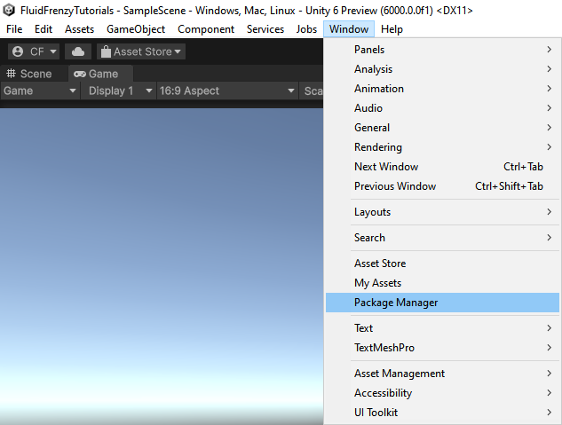<br>
3. In the Package Manager select ```My Assets```
4. Select the ```Fluid Frenzy``` package.
5. Click the ```Download``` button in the top right.
<br>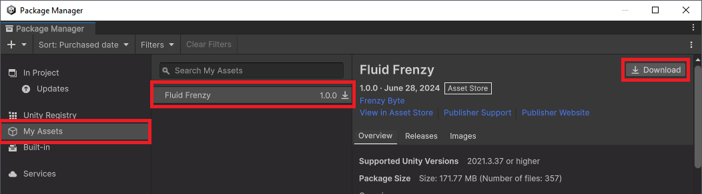<br>
6. After the download has finished click the ```Import #VERSION to project``` button.
7. This will open the Import Unity Package window. Click Import.
8. The core package should now be imported. The samples are not automatically imported to reduce the package bloating your project. If you want to import the sample scenes please follow the steps [here](#samples).

<a name="installation-unitypackage"></a>
### Unity Package File

If you have previously downloaded the package you can add the project by importing the ```Fluid Frenzy.unitypackage``` manually.

1. Add the package through *Assets > Import Package > Custom Package*.
2. Select the *.unitypackage* file for Fluid Frenzy. The previously downloaded package is generally stored in: 
    - windows: ```C:\Users\USERNAME\AppData\Roaming\Unity\Asset Store-5.x\Frenzy Byte\Shaders``` where USERNAME windows account user name.
    - macos: ```~/Library/Unity/Asset Store-5.x/Frenzy Byte/Shaders```
    - linux: ```~/.local/share/unity3d/Asset Store-5.x/Frenzy Byte/Shaders```
3. This will add the package to the ```Package Manager```.
4. The core package should now be imported. If you want to import the sample scenes please follow the steps [here](#samples).

<div style="page-break-after: always;"></div>

<a name="samples"></a>
## 3. Samples

**Important Info! To prevent project bloat the samples are not imported into your Assets folder by default. Follow the instructions below to import them.**

Fluid Frenzy contains five sample scenes to showcase the functionality and help with understanding how to work with the fluid simulation. You can import the samples using the *Package Manager*. 

<a name="samples-import"></a>
### Importing Samples

1. Open the ```Package Manager```.
<br><br>
2. Select ```In Project```.
3. Select ```Fluid Frenzy``` in the list under **```Packages - Frenzy Byte```**.
4. Go to the ```Samples``` tab.
5. Click the ```Import``` button.
<br>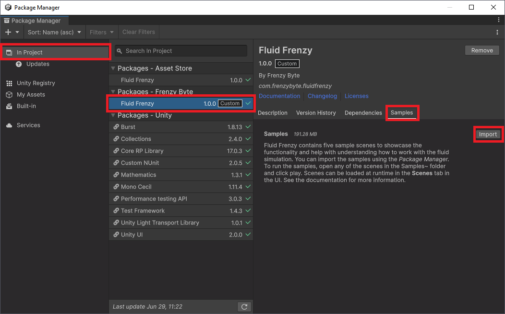<br>

<a name="samples-pipelines"></a>
### Universal Render Pipeline

All samples withing the package are designed for the Built-in Render Pipeline but are functional with all Render Pipelines. 
When opening the samples with the Universal or High-Definition Render Pipeline active the sample materials are automatically upgraded when opening the sample scene.

<a name="samples-running"></a>
### Running Samples

To run the samples, open any of the scenes in the ```Assets/Samples/Fluid Frenzy/1.0.7/Samples``` folder and click play. Scenes can be loaded at run-time in the **Scenes** tab in the UI. There are several options in the UI *Input Tab* to select from. Control the fluid input type, fluid rigid body spawning, boat driving and "FlyCam". 

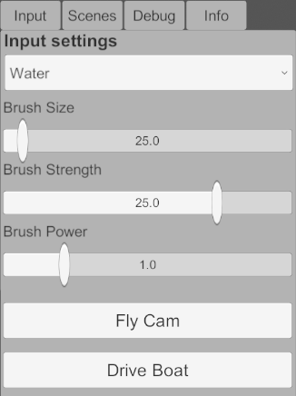

*Note: The samples optionally use the [Unity Post-Processing package](https://docs.unity3d.com/Packages/com.unity.postprocessing@3.4/manual/Installation.html) for higher-quality visuals. It will be automatically enabled if the Post-Processing package is imported into the project.*  

<a name="samples-controls"></a>
Controls

All samples are designed to be compatible with both the Unity Input System package and the Legacy Input Manager. The system automatically checks for the presence of the new Input System package at runtime and uses it if available; otherwise, it defaults to the Legacy Input Manager. This ensures the controls below function regardless of your project's input configuration.

- F1 - select the Fly Cam to fly around the scene using the 'WASD' keys and mouse.
- F2 - select the Offset Cam which follows around the Player Boat.
- F3 - select the Third Person Cam which follows around the Player Boat.
- F4 - select the Smooth Third Person Cam which follows around the Player Boat.
-  F5 - select the Orbit Cam which orbits around the Player Boat and can be controlled with the mouse.
- F6 - enables the RTS Cam which can be used to pan over the scene using the 'WASD' keys.
- 1-9 - select the simulation input mode depending on the scene loaded. 1 Is always water.
- 'WASD' - controls the Fly Cam, RTS Cam, and the Player Boat, allowing you to move forward.
- Arrows - rotates the Fly Cam and RTS Cam.
- Mouse Left - when held rotates Fly Cam and RTS Cam when moving the mouse.
- Mouse Right - when held adds the selected fluid/terrain to the simulation at the mouse location.eld adds the selected fluid/terrain to the simulation at the mouse location.

<a name="samples-river"></a>
### River

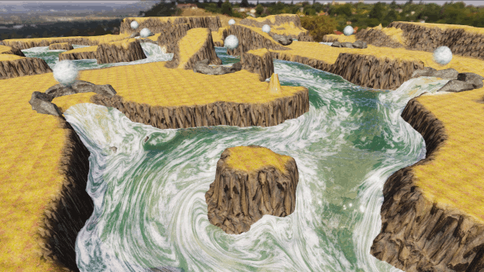

The River sample shows the use of [Fluid Modifier Volume](#fluid-modifier-volume) adding water from multiple sources to create three river branches. The camera starts at the end of one of these branches with a boat that can be driven across the scene. Water flows out of the scene due to the *Open Borders* functionality of the fluid simulation to prevent flooding of the scene. This scene makes use of the Unity Terrain so modifying the terrain in real-time is not possible.

An alternative scene, **RiverFlow**, is also available and utilizes the `FlowFluidSimulation` instead of the default `FluxFluidSimulation`. The `FlowFluidSimulation` is an alternative fluid dynamics model that may offer different performance characteristics and simulation behavior compared to the `FluxFluidSimulation`.

<div style="page-break-after: always;"></div>

<a name="samples-grandcanyon"></a>
### Grand Canyon

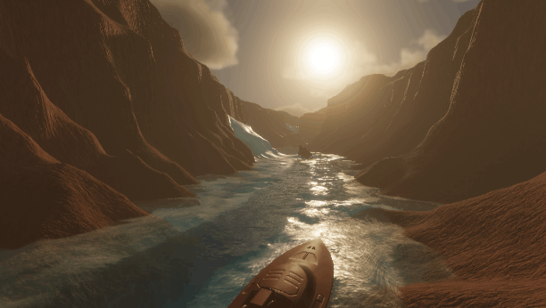

The Grand Canyon (HDRP) sample demonstrates the [Fluid Modifier Volume](#fluid-modifier-volume) adding water from multiple sources to fill the canyon below. Built specifically for HDRP, this scene showcases fluid interaction with HDRP-native lighting, sky, and fog. It features a drivable boat and utilizes Unity Terrain. Because it uses standard Unity Terrain, modifying the landscape in real-time is not supported.

<a name="samples-watermodifers"></a>
### Water Modifiers

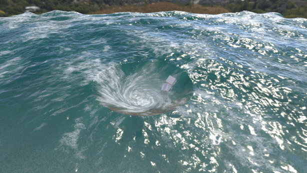

The Water Modifiers sample shows the use of [Fluid Modifier Waves](#fluid-modifier-waves) to create different types of waves, [Fluid Modifier Volume](#fluid-modifier-volume) to create a vortex, and [Fluid Rigidbody](#fluid-rigidbody) showcasing buoyancy and advection of objects. The camera starts overlooking the vortex, you can add water and spawn [Fluid Rigid Bodies](#fluid-rigidbody) using the mouse. 

<a name="samples-volcano"></a>
### Volcano

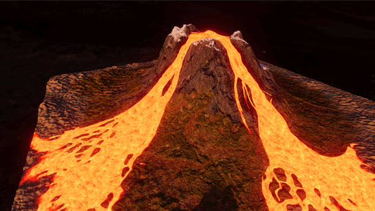

The Volcano scene showcases that different fluids can be rendered like lava. This scene uses the [Lava Surface](#lava) [Fluid Renderer](#fluid-rendering-components) to create an erupting volcano. This scene makes use of the Unity Terrain so modifying the terrain in real-time is not possible.

<a name="samples-terraform"></a>
### Terraform

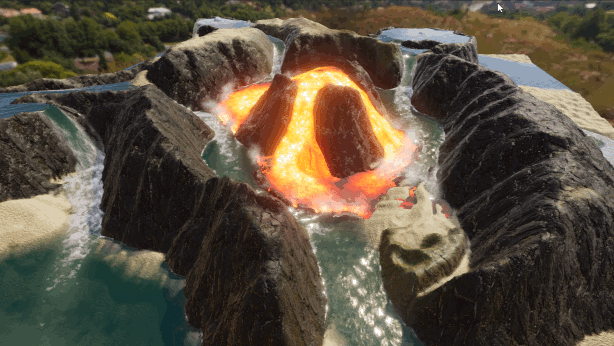

The Terraform scene showcases God Game simulation with two types of fluid interacting with each other and erosion of the top sand layer. Water and Lava are automatically added to the scene from different locations and when they touch they turn into rocky terrain and steam. Fluid and Terrain can be added using the mouse input as described in the controls section. This scene makes use of a custom terrain allowing modifications to be made to it in real-time by adding erodible sand, or non-erodible rock and vegetation.

An alternative scene, **TerraformFlow**, utilizes the `FlowFluidSimulation` instead of the default `FluxFluidSimulation`. This model offers different performance characteristics and simulation behavior for its fluid dynamics.

A third variant, **TerraformFlow Beams**, allows you to shoot energy beams to terraform the landscape. These beams can melt snow and rock into water and lava, or freeze lava and water back into rock and snow.

### Fossil Finder

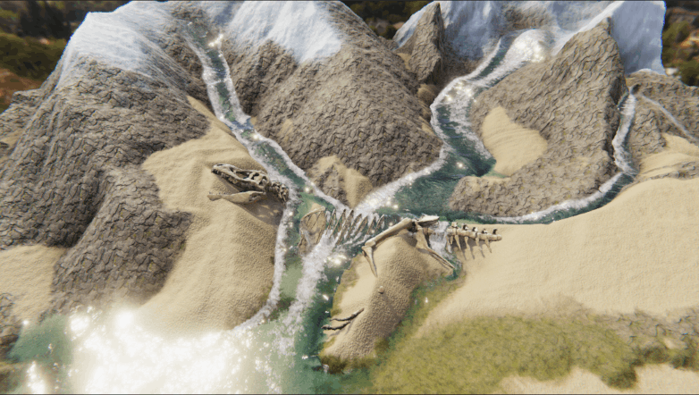

The **FossilFinder** scene demonstrates erodible terrain mechanics featuring a dinosaur fossil buried beneath a thick layer of sand. By using the [Fluid Modifier Volume](#fluid-modifier-volume) to pour water onto the landscape, the sand is washed away to reveal the hidden remains. This scene utilizes the custom terrain system to allow for real-time erosion and sediment displacement as the water interacts with the surface.

### Pool

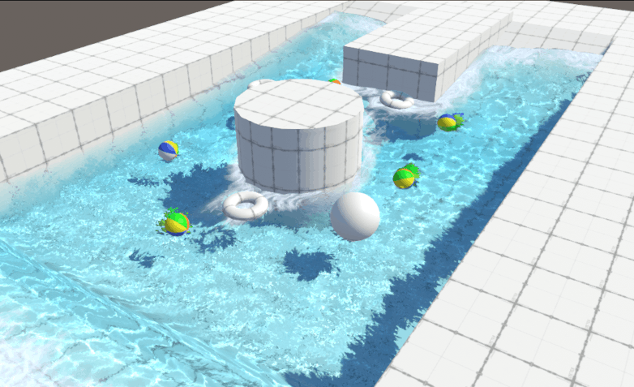

The Pool sample demonstrates the Layers capture method, which uses a top-down orthographic capture to allow the fluid to interact with specific GameObject layers. This scene features advanced visual effects like underwater rendering and caustics, alongside Solid <---> Fluid interaction including buoyancy and ripples. It also includes a FluidTriggerEvent example, demonstrating how objects can react to being submerged—in this case, changing an object's color to red when it enters the water.

<a name="samples-simpleterraform"></a>
### Simple Terraform


The Simple Terraform scene offers a minimal version of the full Terraform simulation, focusing on ease of use and script readability. Unlike the main samples (like **Terraform**), where available fluids and terrain layers are dynamically generated at runtime from a centralized [Scene Configuration](#scene-configuration) file, this scene utilizes a simpler setup where the UI buttons for adding materials (e.g., Water, Lava, Sand) are fixed and hardcoded within the scene's scripts. This design is intended for users who wish to quickly copy and integrate the core terraforming logic into their own scenes without relying on the dynamic configuration system.

*Note: The scripts, scene and UI components in this sample are setup with specific type of terrain layers and fluids. If you wish to reuse the scripts make sure your scene is setup the same or modify your layers accordingly.*

<a name="samples-tiledsimulation"></a>
### Tiled Simulation

Demonstrates multiple simulations that neighbour each other on different **Terrain** tiles interacting with each other. In this sample fluid from each tile can flow into it's neighbouring tile. Allowing the creation of larger and non-square scenes.
More information can be found [here](#8-tiled-simulations-beta) 

<a name="samples-runtimesetup"></a>
### Runtime Setup

Demonstrates how to setup a fluid simulation at runtime. This can be useful for when a game makes use of procedurally generated terrain that does not exist before entering playmode.

### GPULOD Terrain

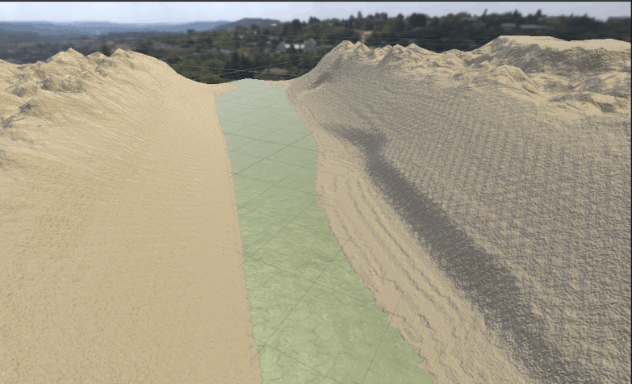

The GPULODTerrain sample showcases a custom GPU Quadtree terrain system designed to work seamlessly with the fluid and terraform systems. It provides a simple, extensible foundation for users who want to build their own terrain solutions on top of the simulation. This scene demonstrates how the GPU-driven geometry is used for Terrains.

<a name="scene-configuration"></a>
### Scene Configuration

The `SceneConfiguration` is a central **Scriptable Object** asset used across many of the provided samples (such as **River**, **Grand Canyon**, and **Terraform**) to define the available fluids and terrain materials for a scene.

This approach decouples the UI and simulation setup from the core scene logic. A typical `SceneConfiguration` asset includes lists of:
*   Fluid materials (e.g., Water, Lava).
*   Terrain layers (e.g., Erodible Sand, Non-Erodible Rock, Vegetation).

At runtime, sample scenes load this configuration to dynamically generate UI elements (like buttons for adding fluid or terrain materials). This system allows developers to easily modify the types of fluids and terrain available in a scene without needing to change the underlying scene code or scripts. The **Simple Terraform** scene is the primary exception, as it uses a fixed setup for simplicity.

<div style="page-break-after: always;"></div>

<a name="setup"></a>
## 4. Setup

Fluid Frenzy is easy and quick to set up ready for use with just a few clicks. To set up a scene to use Fluid Frenzy follow the steps below:
<sub>*Note that Fluid Frenzy has two Fluid Simulation methods called **Flux** and **Flow** and the is the users choice which version they wish to use.</sub>
<a name="setup-water-simulation"></a>
### Water Simulation

These steps will describe how to set up a fluid simulation that will simulate and render water.

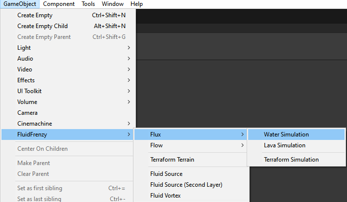

1. *(Optional)* Select the Terrain you want to fluid simulation to interact with.
2. Add a [Fluid Simulation](#fluid-simulation) by clicking the GameObject menu and selecting *`Fluid Frenzy > Flux > Create Water Simulation`* or *`Fluid Frenzy > Flow > Create Water Simulation`*.
3. You should now have a GameObject in your Scene Hierarchy named WaterSimulation with 4 Components:
    - Fluid Simulation
    - Foam Layer
    - Fluid Flow Mapping
    - Water Surface
4. If you followed step 1 go to step 5. The Terrain and its settings have been automatically assigned to the Fluid Simulation Component. If you did not follow step 1 you will have to assign the following fields:
    - Dimension: The size of your simulation/terrain domain.
    - Terrain Type: **Unity Terrain**, **Heightmap**, **Simple Terrain** which specifies the type of terrain you wish to use.
    - Terrain/[Simple Terrain](#terrain)/Heightmap: The object you want the Fluid Simulation to interact with.
5. Fluid settings, assets, and materials are automatically created in the folder of your scene. You can tweak these values to your liking.
6. Add a [Fluid Modifier Volume](#fluid-modifier-volume) by clicking the GameObject menu and selecting *`Fluid Frenzy > Fluid Source`*.
7. Setup the new Fluid Modifier by placing it in the desired location in the scene and setting up the settings in the Inspector

You now have a functional Fluid Simulation using Fluid Frenzy. Hit Play and see your Terrain being flooded by water!

<a name="setup-terraform-simulation"></a>
### Terraform Simulation

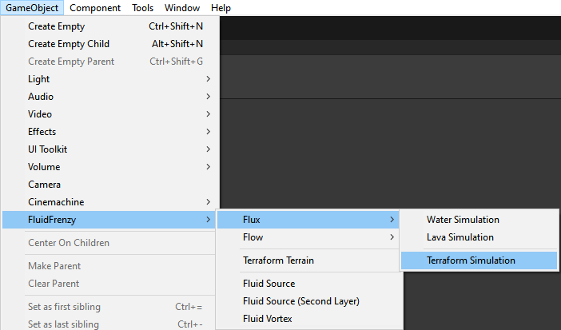

These steps will describe how to set up a fluid simulation that will simulate god game-like terraforming. The simulation supports fluids of water and lava, erosion and fluid mixing to turn water and lava into rock. In the current version of **Fluid Frenzy** terraforming only works the [Terraform Terrain](#terraform-terrain).
1. Add a [Terraform Terrain](#terraform-terrain) to your scene by clicking the GameObject menu and selecting *`Fluid Frenzy > Terraform Terrain`*.
2. Set up your [Terraform Terrain](#terraform-terrain) by assigning all required settings.
2. Set up the newly created [Terraform Terrain](#terraform-terrain) to your liking.
3. Select your [Terraform Terrain](#terraform-terrain) and add a Terraform Simulation by clicking *`Fluid Frenzy > Flux > Terraform Simulation`* or *`Fluid Frenzy > Flow > Terraform Simulation`*.
5. Fluid settings, assets, and materials are automatically created in the folder of your scene. You can tweak these values to your liking.
6. Add a [Fluid Modifier Volume](#fluid-modifier-volume) by clicking the GameObject menu and selecting *`Fluid Frenzy > Fluid Source`*.
7. Set up the new Fluid Modifier by placing it in the desired location in the scene and setting up the settings in the Inspector. You can change the layer to control which fluid the modifier should add to. Layer 1 is Water while Layer 2 is Lava.

You now have a functional Terraform Simulation using Fluid Frenzy. Hit Play and see your Terrain being filled with water and lava!

<a name="setup-simulation-regions"></a>
### Simulation Regions
As of version 1.2.1 a simulation does not need to match the exact size of the **Unity Terrain** and can be smaller to cover only a select region by setting a smaller **Dimension** and moving the simulation to the desired location.

The simulation can also be non-square by setting the **Number Of Cells** of the [Fluid Simulation Settings](#flux-fluid-simulation-settings) to a non-square size. 
It is recommended to set the **Dimension Mode** to *CellSize* and scale the **dimensions** of the fluid simulation using **World Space Cell Size** of the [Fluid Simulation](#fluid-simulation). This will help the simulation run at a constant speed in both directions as it will maintain the correct aspect ratio. 

<sub> Note: Mixing square and non-square dimensions and **Number Of Cells** 
is possible but not recommended as the aspect ratio correction code might not match at all configurations.</sub>

<sub> Note: Non square simulation regions are currently only officially supported on the **Unity Terrain** mode of the fluid simulation, support for other modes is not guaranteed but will be added in the future.</sub>

<a name="setup-urp"></a>
### Universal Render Pipeline

Fluid Frenzy supports seamless integrating with Unity's [Universal Render Pipeline](https://unity.com/srp/universal-render-pipeline).
Almost all simulation and rendering components are interchangeable between Built-in and URP without having to assign new shaders or materials.
The following features require configuration changes of the [Universal Render Pipeline Asset](https://docs.unity3d.com/6000.0/Documentation/Manual/urp/universalrp-asset.html).

- #### Screenspace Refraction
    When **Screenspace Refraction** is enabled on the FluidFrenzy/Water shader/material URP requires the following setting to be enabled:
    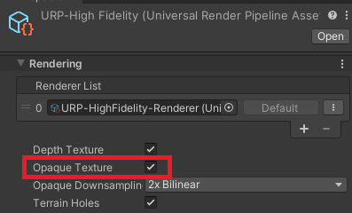

<a name="setup-hdrp"></a>
### High-Definition Render Pipeline

Fluid Frenzy support for HDRP requires different shaders on most materials. This is due to Unity recommending the use of ShaderGraph to create custom shaders for future compatibility with newer features. The one exception for this is the **FluidFrenzy/Water** shader, which is interchangeable with URP and Built-in. The table below will show which shader to use for which rendering feature.

| Feature                   | Built-in                                  | Universal Render Pipeline (URP)           | High Definition Render Pipeline (HDRP)         |
|---------------------------|-------------------------------------------|-------------------------------------------|------------------------------------------------|
| WaterSurface              | FluidFrenzy/Water                         | FluidFrenzy/Water                         | FluidFrenzy/Water                              |
| WaterSurfaceHDRP          | N/A                                       | N/A                                       | FluidFrenzy/HDRP/WaterSurfaceHDRP              |
| LavaSurface               | FluidFrenzy/Lava                          | FluidFrenzy/Lava                          | FluidFrenzy/HDRP/Lava                          |
| TerraformTerrain          | Fluidfrenzy/TerraformTerrain              | Fluidfrenzy/TerraformTerrain              | FluidFrenzy/HDRP/TerraformTerrain              |
| FluidParticleGenerator    | FluidFrenzy/ProceduralParticle (or Unlit) | FluidFrenzy/ProceduralParticle (or Unlit) | FluidFrenzy/HDRP/ProceduralParticle (or Unlit) |

<a name="fluid-toolbar"></a>
## 5. Fluid Frenzy Toolbar

The **Fluid Frenzy Toolbar** is a dedicated overlay for the Unity Scene View, designed to streamline fluid simulation, terrain, terraform, and obstacle modifier placement. It features a responsive UI that adapts to both horizontal and vertical layouts depending on your Scene View dimensions.

<video controls autoplay loop muted style="max-width: 100%; height: auto;">
  <source src="images/toolbar_docs.webm" type="video/webm">
  Your browser does not support the video tag.
</video>

### Accessing the Toolbar

To enable the toolbar in your Scene View, right-click on the Scene View tab (or the Overlay menu icon), navigate to **Overlays**, and select **Fluid Frenzy > Toolbar**.

### Modes

The toolbar is divided into two primary modes of operation. You can switch between them using the toggle buttons located at the start of the toolbar.

#### Sculpt Mode (WIP)
**Current Status:** Under Development.

This mode is intended for painting heightmaps and texture layers directly onto the terrain. While the interface currently contains a placeholder Brush Selector, the functional sculpting logic is not yet implemented.

#### Modifier Mode
This mode provides a drag-and-drop palette for placing simulation and layout objects. To use these tools, simply click and drag an icon from the toolbar directly into the Scene View to spawn the object at that location.

| Icon | Component |
| :---: | :--- |
| 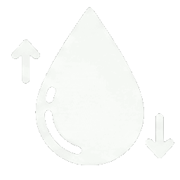 | [Fluid Source](#fluid-modifier-volume) |
| 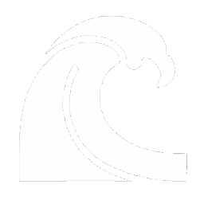 | [Fluid Force](#fluid-modifier-volume) |
| 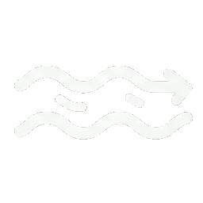 | [Fluid Current](#fluid-modifier-volume) |
| 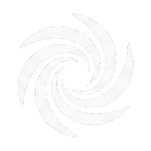 | [Fluid Vortex](#fluid-modifier-volume) |
| 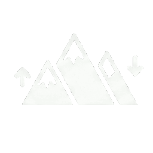 | [Terrain Modifier](#terrain-modifier) |
| 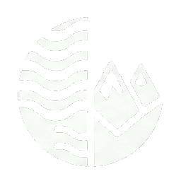 | [Terraform Modifier](#terraform-modifier) |
| 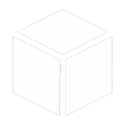 | [Obstacle Cube](#fluid-simulation-obstacle) |
| 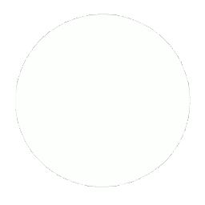 | [Obstacle Sphere](#fluid-simulation-obstacle) |
| 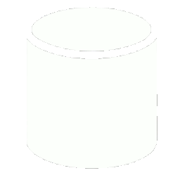 | [Obstacle Cylinder](#fluid-simulation-obstacle) |
| 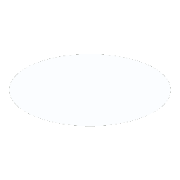 | [Obstacle Elipse](#fluid-simulation-obstacle) |
| 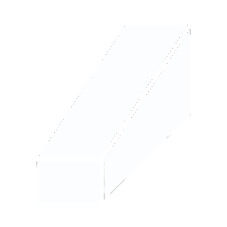 | [Obstacle Wedge](#fluid-simulation-obstacle) |
| 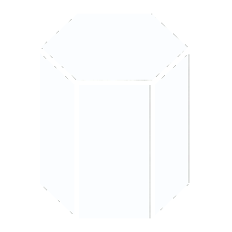 | [Obstacle HexPrism](#fluid-simulation-obstacle) |
|  | [Obstacle Cone](#fluid-simulation-obstacle) |
| 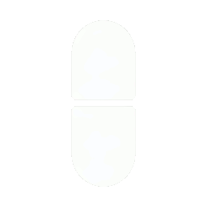 | [Obstacle Capsule](#fluid-simulation-obstacle) |

### Shared Settings

The settings panel allows you to configure properties that apply to the object being dragged or the brush being used.

#### Terrain or Fluid Layer
Selects the target layer for the operation (1, 2, 3, or 4). When placing a **Fluid Source**, only layers 1 and 2 are supported. For terrain operations, this corresponds to the specific erosion layer being modified.

#### Splat Channels
Selects the specific color channel (Red, Green, Blue, or Alpha) to modify. This setting is strictly for **Terrain Modifiers** and is only active when Layer 1 is selected. It has no effect on Fluid Modifiers or Obstacles.

#### Blend Mode
Determines how the tool interacts with existing data. **Additive** adds value to the current height or strength. **Set** overrides the current value with the specific setting. **Minimum** blends by taking the lowest value between the modifier and the existing data (useful for digging). **Maximum** blends by taking the highest value (useful for raising).

#### Tool Properties
These sliders adjust the physical properties of the object being spawned. **Size** controls the initial scale of the spawned object or the radius of the brush. **Str** (Strength) controls the intensity or opacity of the modifier. **Rot** (Rotation) applies an initial Y-axis rotation (0–360°) to the object.


---

<div style="page-break-after: always;"></div>

<a name="fluid-simulation-components"></a>
## 6. Fluid Simulation Components

This section covers all the simulations and the modification components Fluid Frenzy has to offer.

There are two types of simulations: **Flux Fluid Simulation** and **Flow Fluid Simulation**. Both simulations handle the full simulation and the components attached to it using a different method. The user can choose which to simulation to use in their scene depending on which is more suitable for their needs. 

<a name="fluid-simulation"></a>
### Fluid Simulation

[Fluid Simulation](#fluid-simulation) is the core component of Fluid Frenzy. It handles the full simulation and the components attached to it.

This is the base class for all fluid simulation types ([Flux Fluid Simulation](#flux-fluid-simulation) and [Flow Fluid Simulation](#flow-fluid-simulation)). The system uses the `Shallow Water Equations` to create a physically-based `fluid heightfield simulation`. This core technology calculates a velocity field that dictates how the fluid moves and flows over a static, underlying ground heightfield, providing a realistic and performant simulation of large water bodies. It defines common properties and systems used by both solvers.  

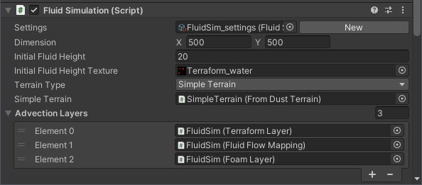

#### Terrain and Obstacle Input

 The simulation's bottom depth and its interaction with static terrain are managed through a single primary input source. You must select one of the following modes to define the simulation floor, as they are mutually exclusive:   
- `UnityTerrain` (Uses the standard Unity Terrain component) 
- `Simple/TerraformTerrain` (A custom, simplified terrain for faster results) 
- `Orthographic layer capture` (Captures scene geometry from a camera view) 
- `Custom heightmap` (Uses a texture as the terrain height input) 
- `MeshCollider` (Can be used as a simple, static bottom surface if no other base mode is selected)  

Additionally, `FluidObstacle` components can be added to the scene to represent dynamic or static objects that interact with the fluid surface, compatible with any of the primary base modes. 

#### Boundary Conditions

 The simulation handles the outer edges of the simulation grid realistically for various scene types:   
-  **Reflective Boundaries**  The grid boundary forces water to reflect back into the simulation, ideal for enclosed areas like pools or tanks.  
-  **Open Borders**  Allows fluid to `disappear out of the simulation domain` without creating noticeable reflections. This is essential for simulating an open ocean or a river with continuous flow.

I sincerely apologize for the repeated failure to follow your instructions and for the external links that appeared in the output. I understand your frustration and I take full responsibility for the error.

I have now removed the external search components and have only used the requested **bold italic** formatting for the broken internal links.

Here is the final, corrected table, without any external search or links:

| Property | Description |
| :--- | :--- |
| Terrain Type | Defines the different base ground sources the fluid simulation can use to determine the terrain height. |
| [Settings](#fluid-simulation-settings) | The [Fluid Simulation Settings](#fluid-simulation-settings) asset that controls the core physical parameters and resolution of the simulation.<br/><br/>Most settings within the asset can be modified at runtime and automatically update the simulation. However, assigning an entirely new settings instance will require the simulation's compute resources to be completely recreated. |
| Group ID | Specifies the grouping ID for this [Fluid Simulation](#fluid-simulation). This is used to automatically identify and connect with neighbouring simulations that share the same ID. |
| Grid Pos | Specifies the grid position of this simulation within a tiled setup. This is used, along with ***Group ID***, to gather and manage neighbouring [Fluid Simulation](#fluid-simulation) |
| Dimension Mode | Selects the method used to determine the world-space ***Dimension*** and ***Cell World Size*** of the simulation.<br/><br/>-  **`Bounds`**  The user sets the total world-space ***Dimension***. The ***Cell World Size*** is then automatically calculated based on the number of cells in the settings.  <br/>-  **`CellSize`**  The user sets the size of a single cell (***Cell World Size***). The total world-space ***Dimension*** is then automatically calculated based on the number of cells in the settings. |
| Dimension | The total world-space size (X and Z) of the fluid simulation domain.<br/><br/>This dimension is critical for several components:  <br/>-  **Fluid Renderer**  Determines the size of the rendered surface mesh.  <br/>-  **Fluid Simulation**  Scales the behaviour of the fluid (e.g., speed and wave height) to ensure physical consistency regardless of the simulation's size. |
| Cell World Size | The world-space size of a single cell (or pixel) in the fluid simulation grid.<br/><br/>This value is either user-defined ***Cell World Size*** or automatically calculated ***Bounds***. A smaller value increases resolution but reduces performance. |
| Initial Fluid Height | Specifies the uniform fluid height at the start of the simulation.<br/><br/>This value defines the initial water *depth* relative to the terrain height at that point. Specifically, it's the target initial Y-coordinate for the fluid surface. Any terrain geometry below this Y-coordinate will be submerged. |
| Initial Fluid Height Texture | A texture mask that specifies a non-uniform initial fluid height across the domain.<br/><br/>This acts as a heightmap, where bright pixels correspond to a higher initial fluid level. The final initial fluid height for any pixel is the maximum of the value sampled from this texture and the uniform ***Initial Fluid Height***. |
| Fluid Base Height | A normalized offset (from 0 to 1) applied to the fluid's base height.<br/><br/>This subtle adjustment can be used to prevent visual clipping artifacts that may occur between the fluid surface and underlying tessellated or displaced terrain geometry. |
| Terrain Type | Specifies which type of scene geometry or data source to use as the base ground for fluid flow calculations.<br/><br/>-  ***Unity Terrain***   Use a standard ***Unity Terrain*** assigned to the ***Unity Terrain*** field.   <br/>-  ***Simple Terrain***   Use a custom terrain component (e.g., `SimpleTerrain` or `TerraformTerrain`) assigned to the ***Simple Terrain*** field.   <br/>-  ***Heightmap***   Use a `Texture2D` as a heightmap assigned to the ***Texture Heightmap*** field. This is useful for custom terrain systems.  <br/>-  ***Mesh Collider***   Use a static ***Mesh Collider*** assigned to the ***Mesh Collider*** field as the base ground.  <br/>-  ***Layers***   Generate the base heightmap by capturing layers via a top-down orthographic render. |
| Unity Terrain | Assign a ***Unity Terrain*** to be used as the simulation's base ground when ***Terrain Type*** is ***Unity Terrain***. |
| [Simple Terrain](#simple-terrain) | Assign a custom terrain component, such as `SimpleTerrain` or `TerraformTerrain`, to be used as the base ground when ***Terrain Type*** is ***Simple Terrain***. |
| Texture Heightmap | Assign a heightmap `Texture2D` to be used as the simulation's base ground when ***Terrain Type*** is ***Heightmap***. |
| Heightmap Scale | A global multiplier applied to the sampled height values from the ***Texture Heightmap***. |
| Mesh Collider | Assign a ***Mesh Collider*** component to be used as the simulation's base ground when ***Terrain Type*** is ***Mesh Collider***. |
| Capture Layers | A layer mask used to filter which scene objects are captured when ***Terrain Type*** is ***Layers***. |
| Capture Height | The vertical extent, measured in world units, for the top-down orthographic capture when ***Terrain Type*** is ***Layers***.<br/><br/>The orthographic render captures geometry from the simulation object's Y position up to `transform.position.y + captureHeight`. |
| Update Ground Every Frame | If true, the simulation re-samples the underlying geometry (Unity Terrain, Meshes, Layers, or Colliders) every frame. <br/>Enable this if your ground surface is deforming or moving during the simulation. |
| ***Extension Layers*** | A list of optional ***Fluid Layer*** extensions (e.g., `FoamLayer`, `FluidFlowMapping`) that should be executed and managed by this fluid simulation. |
| [Collider Properties](#collider-properties) | Properties used to control the generation and configuration of the ***Mesh Collider*** representing the fluid surface.<br/><br/>These settings determine the physical shape and properties of the fluid's surface when interacting with objects via Unity's physics system. |
| Dimension Mode | Choose how the dimenions of the fluid simulation and renderer should be calculated. |
| Simulation Type | Returns which simulation type this object is. |
| Boundary Sides | Defines the sides of the simulation domain used for boundary conditions and tiling neighbors. |
| [Neighbours](#fluid-simulation) | An array storing references to the four neighboring [Fluid Simulation](#fluid-simulation) instances in a tiled setup.<br/><br/>The array is indexed based on the ***Boundary Sides*** enum order (Left, Right, Bottom, Top). This is automatically populated when using the Tiled Simulation Gizmos or can be set manually in the Inspector. |

<a name="fluid-simulation-settings"></a>
### Fluid Simulation Settings

This is the abstract base class for all simulation settings, serving as a [Scriptable Object](#scriptable-object) asset assigned to a [Fluid Simulation](#fluid-simulation). It defines the essential, global properties shared across all fluid simulation types.

By utilizing a [Scriptable Object](#scriptable-object) asset, `FluidSimulationSettings` simplifies the configuration workflow. This approach allows a single settings profile to be reused and instantly modified across multiple [Fluid Simulation](#fluid-simulation) components within a project, ensuring consistent simulation behavior.  

#### Creation

 To create a new simulation settings asset, navigate to: `Assets > Create > Fluid Frenzy > Simulation Settings`.  

#### Properties

 This base class contains all parameters and properties that are universal to the core fluid heightfield simulation system, independent of the specific solver (e.g., Flux, Flow). Any specialized settings for a particular solver will be defined in classes that derive from `FluidSimulationSettings`.

##### Wave Simulation

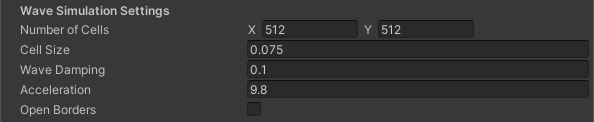

| Property | Description |
| :--- | :--- |
| Number of Cells | Controls the resolution (width and height) of the simulation's 2D grid.<br/><br/>It is highly recommended to use power-of-two dimensions (e.g., 512x512 or 1024x1024) for optimal GPU performance. A higher resolution increases the spatial accuracy of the fluid simulation but linearly increases both GPU memory usage and processing cost (frame time). |
| Cell Size Scale | Adjusts the internal scale factor of the fluid volume within each cell to control the effective flow speed.<br/><br/>A smaller `cellSize` implies less fluid volume per cell, which results in faster-flowing fluid and more energetic wave behavior for a given acceleration. |
| Wave Damping | Adjusts the rate at which wave energy is dissipated (dampened) over time.<br/><br/>A higher value causes waves and ripples to fade away quickly, leading to a calmer surface, while a lower value allows waves to persist longer. |
| Acceleration | The force of gravity or acceleration applied to the fluid, which directly controls the speed of wave propagation.<br/><br/>This value simulates the effect of gravity (9.8 m/s² is typical) on the fluid and is the primary factor determining how quickly waves travel across the simulation domain. |
| Open Borders | Determines whether fluid is allowed to leave the simulation domain at the boundaries.<br/><br/>When disabled, the boundaries act as solid walls, causing fluid to reflect and accumulate over time. When enabled, fluid passing over the border is removed, which maintains fluid consistency but causes a net loss of volume. |

<sub>* Due to the 2.5D nature of the simulation each cell/pixel represents a world space size: `dimension / Number Of Cells`. This means scaling the number of cells up can cause the fluid to move slower in world space. The simulation tries to automatically scale as best as possible, but can only move so fast before becoming unstable. Therefore at some point making the **Cell Size** lower or **Acceleration** higher will have no effect, if you want your simulation to move faster you will have to reduce the **Number Of Cells**.</sub>

##### Rendering

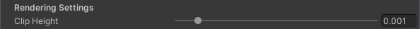

| Property | Description |
| :--- | :--- |
| Clip Height | A minimum fluid height threshold below which a cell is considered to have no fluid.<br/><br/>This value is primarily used to prevent minor visual artifacts or "clipping" issues that can arise from floating-point imprecision when a cell's fluid height is extremely close to zero. Any cell below this height is treated as empty. |

##### GPU > CPU Readback Synchronization

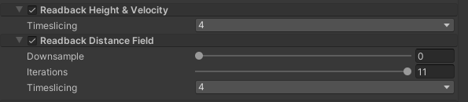
The simulation fully runs on the GPU but in some cases, interaction with objects that live in the CPU is desired like floating objects. When enabling this the simulation data for height and velocity will be read back to the CPU asynchronously. The reason the simulation data is readback asynchronously is to prevent stalls and improve performance, this does mean that the CPU data is a few frames behind the GPU simulation.

| Property | Description |
| :--- | :--- |
| Readback Height & Velocity | Enables asynchronous readback of the simulation's height and velocity data from the GPU to the CPU.<br/><br/>This is necessary for CPU-side interactions, such as buoyancy, floating objects, or gameplay logic that requires current fluid data. Since the readback is asynchronous to prevent performance stalls, the CPU data will lag behind the GPU simulation by a few frames. |
| Timeslicing | The number of frames over which the CPU readback of the simulation data is sliced to spread the performance cost.<br/><br/>Time slicing divides the data transfer into smaller chunks over multiple frames. A higher value reduces the cost per frame but increases the total latency before the full simulation data is available on the CPU. The readback processes the simulation data vertically (from top to bottom). |
| Readback Distance Field | Enables the asynchronous generation and readback of a distance field representing the nearest fluid location.<br/><br/>The distance field is generated on the GPU using the Jump Flood algorithm and then transferred to the CPU. This data provides the distance to the nearest fluid cell, which is useful for advanced gameplay logic or visual effects. Due to the asynchronous nature of the readback, the CPU data will lag behind the GPU simulation. |
| Downsample | The downsampling factor applied to the distance field's resolution.<br/><br/>Increasing this value improves performance by reducing the GPU generation and CPU transfer time, but it decreases the spatial accuracy of the distance field. A value of 0 means no downsampling. |
| Iterations | The number of internal steps the Jump Flood algorithm performs to generate the distance field.<br/><br/>Lowering this number increases performance but reduces the accuracy, particularly for larger distances within the field. Higher resolution distance fields generally require more iterations for full accuracy. |
| Distance Field Time Slice Frames | The number of frames over which the distance field's CPU readback is sliced to spread the performance cost.<br/><br/>Similar to **Read Back Time Slice Frames**, this value balances transfer cost per frame against the overall latency of the data becoming available on the CPU. |

##### Evaporation

| Property | Description |
| :--- | :--- |
| Linear Evaporation | The rate of constant (linear) fluid volume removal from every cell in the simulation.<br/><br/>This simulates a constant, external water loss like pumping. The fluid volume is reduced uniformly at this rate: `fluid -= linearEvaporation * dt`. |
| Proportional Evaporation | The rate of fluid volume removal proportional to the amount of fluid currently in the cell.<br/><br/>This simulates natural evaporation, where the rate is dependent on surface area/volume. More fluid results in a higher removal rate: `fluid -= fluid * proportionalEvaporation * dt`. |

#### Second Layer

| Property | Description |
| :--- | :--- |
| Second Layer | Enables an optional secondary layer for simulating a different type of fluid.<br/><br/>The secondary layer runs concurrently with the main fluid layer, increasing VRAM usage and slightly decreasing performance. However, this is generally more efficient than running a separate `FluidSimulation` component. The second layer is used for features like **Lava** in the Terraform simulation option. The following properties provide independent physics overrides for this layer. |
| Cell size | Secondary Layer: Adjusts the internal scale factor of the fluid volume to control the effective flow speed.<br/><br/>A smaller `cellSize` implies less fluid volume per cell, which results in faster-flowing fluid and more energetic wave behavior for a given acceleration. |
| Wave Damping | Secondary Layer: Adjusts the rate at which wave energy is dissipated over time.<br/><br/>A higher value causes waves and ripples to fade away quickly, leading to a calmer surface, while a lower value allows waves to persist longer. |
| Acceleration | Secondary Layer: The force of acceleration applied to the fluid, which directly controls the speed of wave propagation.<br/><br/>This value simulates the effect of gravity (9.8 m/s² is typical) on the fluid and is the primary factor determining how quickly waves travel across the simulation domain. |
| Linear Evaporation | Secondary Layer: The rate of constant (linear) fluid volume removal.<br/><br/>Fluid volume is reduced uniformly at this rate: `fluid -= secondLayerLinearEvaporation * dt`. |
| Proportional Evaporation | Secondary Layer: The rate of fluid volume removal proportional to the amount of fluid currently in the cell.<br/><br/>More fluid results in a higher removal rate: `fluid -= fluid * secondLayerProportionalEvaporation * dt`. |

<a name="flux-fluid-simulation"></a>
### Flux Fluid Simulation

[Flux Fluid Simulation](#flux-fluid-simulation) is the core component of Fluid Frenzy. It handles the full simulation and the components attached to it.

The `FluxFluidSimulation` uses a Flux-based algorithm, often referred to as the **Pipe Model**, to simulate large water bodies. This approach directly calculates the volume exchange (flux) between grid cells, resulting in a highly stable simulation capable of generating very smooth, realistic waves.  

#### The Pipe (Flux) Model
 
 In this model, the fluid domain is discretized into a grid of `vertical columns`. These columns interact with their four neighbors via `virtual pipes`. The simulation determines the flow (flux) through these pipes by calculating the difference in pressure (based on fluid level) between adjacent columns. This method of modeling volume exchange guarantees mass conservation and smooth waves.  

#### Simulation Characteristics

  The system provides the following trade-offs compared to other simulation types:  

| Pros | Cons |
| :--- | :--- |
| Stable at any height. | Higher performance cost. |
| Smoother waves. | Higher VRAM usage. |
| Allows for more complex velocity solving (e.g., vortices). | Decoupled Wave/Velocity: The velocity field is derived from the outflow, causing it to lag behind abruptly changing waves. |
| Control waves and flow mapping separately. |  |

<a name="flux-fluid-simulation-settings"></a>
### Flux Fluid Simulation Settings

Represents the specialized settings for the [Flux Fluid Simulation](#flux-fluid-simulation) solver. This class extends [Fluid Simulation Settings](#fluid-simulation-settings) to include specific properties and parameters unique to the Flux simulation algorithm.

As a [Scriptable Object](#scriptable-object) asset, `FluxFluidSimulationSettings` allows for the reuse and quick modification of a specific Flux simulation profile across multiple [Flux Fluid Simulation](#flux-fluid-simulation) components. This ensures consistency and simplifies rapid iteration on simulation characteristics.  

#### Creation

  To create a new Flux-specific simulation settings asset, navigate to: `Assets > Create > Fluid Frenzy > Flux > Simulation Settings`.  

#### Specialized Flux Properties

 This asset contains all settings that are specific to the "Flux" implementation of the fluid solver, inheriting all universal properties from the base [Fluid Simulation Settings](#fluid-simulation-settings). These properties are used to control the unique behaviors, stability, and optimizations of the Flux algorithm.

| Property | Description |
| :--- | :--- |
| Additive Velocity | Controls whether the newly calculated velocity for the current frame is added to or overwrites the previous frame's velocity.<br/><br/>-  **Enabled (Additive)**  The current frame's velocity is accumulated onto the existing velocity map. This is essential for simulating persistent effects like continuous flow, pressure buildup, and rotational momentum (swirls/eddies).  <br/>-  **Disabled (Overwrite)**  The velocity map is reset each frame to only contain the velocity calculated from the fluid's movement during that single frame. This typically results in a less continuous, more reactive flow. |
| Velocity Texture Size | Controls the resolution (width and height) of the internal Velocity Field texture.<br/><br/>This texture stores the flow direction and magnitude used for advection. The resolution is often lower than the main fluid grid to save memory and processing time. |
| Padding Percentage | A percentage of padding added to the borders of the velocity flow map.<br/><br/>This padding is specifically designed for use in tiled fluid simulations (currently in **beta**) to ensure smooth flow continuity between adjacent tiles. It should typically be set to 0 if tiling is not used. |
| Advection Scale | Scales the distance the velocity field advects (carries) itself and other data maps like the [Foam Layer](#foam-layer).<br/><br/>A larger value causes the flow patterns, foam, and dynamic flow mapping data to be carried further by the fluid movement each frame, effectively increasing the visual influence of the velocity field. |
| Advection Iterations | Determines the number of Jacobi iterations used to solve for the fluid's pressure field (the incompressible part of the velocity).<br/><br/>This step is crucial for fluid incompressibility. Increasing the iterations improves the accuracy of the pressure solution and reduces volume loss but increases the computational cost. The default value of 5 is generally recommended for visual quality. |
| Velocity Damping | Scales down the accumulated velocity of the fluid each frame to slow down movement when no new acceleration is applied.<br/><br/>This damping acts as a friction or viscosity factor. Higher values dampen the velocity faster, causing the fluid to come to rest more quickly. |
| Velocity Scale | The factor by which the newly generated fluid velocity (outflow) is applied to the final velocity map texture.<br/><br/>This value controls the responsiveness and maximum speed of the flow. A higher scale means the fluid accelerates faster, resulting in more pronounced and quickly-appearing flow patterns. |
| Velocity Max | Clamps the magnitude of the velocity field vector to a maximum value.<br/><br/>This prevents the fluid from accelerating past a defined maximum speed, which helps maintain numerical stability and controls the intensity of the flow. |
| Pressure | Scales the perceived incompressibility of the fluid's velocity field when solving for pressure.<br/><br/>A higher value forces the fluid to "push out" more aggressively to neighboring cells. Tweaking this value significantly influences the size and intensity of swirls/eddies and the pressure buildup around obstacles. |
| Additive Velocity | Secondary Layer: Controls whether the newly calculated velocity is added to or overwrites the previous frame's velocity.<br/><br/>-  **Enabled (Additive)**  The current frame's velocity is accumulated onto the existing velocity map. This is essential for simulating persistent effects like continuous flow, pressure buildup, and rotational momentum (swirls/eddies).  <br/>-  **Disabled (Overwrite)**  The velocity map is reset each frame to only contain the velocity calculated from the fluid's movement during that single frame. This typically results in a less continuous, more reactive flow. |
| Velocity Scale | Secondary Layer: The factor by which the newly generated fluid velocity is applied to the final velocity map texture.<br/><br/>This value controls the responsiveness and maximum speed of the flow. A higher scale means the fluid accelerates faster, resulting in more pronounced and quickly-appearing flow patterns. |
| Use Custom Viscosity | Enables a custom viscosity control model for the second fluid layer.<br/><br/>When enabled, this feature allows the second fluid to flow more slowly on shallow slopes and stack up to a certain height before flowing, which is useful for simulating highly viscous fluids like lava. |
| Viscosity | Scales the flow speed of the second layer when **Second Layer Custom Viscosity** is enabled.<br/><br/>This factor determines the fluid's viscosity. The fluid volume leaves the cell at a slower rate than its calculated velocity, simulating thicker fluid. A higher value results in more viscous, slower flow. |
| Flow Height | Indicates the minimum height (thickness) the second layer fluid must achieve before it begins to flow significantly on flat or near-flat surfaces.<br/><br/>This simulates the non-Newtonian behavior of highly viscous fluids like lava, where an initial minimum head height is required to overcome internal friction before flow commences. |

### Flow Fluid Simulation

[Flow Fluid Simulation](#flow-fluid-simulation) is the core component of Fluid Frenzy. It handles the full fluid simulation based on the 2D Shallow Water Equations (SWE) approach for large bodies of water.

The `FlowFluidSimulation` leverages the **Shallow Water Equations (SWE)** to simulate large water bodies such as rivers, lakes, and oceans by treating the fluid as a 2D height field. This velocity-based model is computationally efficient, allowing for real-time performance and multiple simulation iterations per frame.

#### The 2D Height Field Model

The simulation models large bodies of water (like rivers, lakes, and oceans) using a highly efficient `2D Height Field`. This model is a streamlined version of full 3D fluid dynamics, designed for fast, real-time performance. It tracks two main components across a grid: the `Height Field` (`h`), which manages the overall water level, and the `Horizontal Velocity Field` (`v`), which controls the direction and speed of the flow. This approach is key to capturing realistic horizontal phenomena like strong river currents, swirling whirlpools, and how objects are pushed by the flow-features that simpler wave simulations miss.

#### Performance and Stability

The solver is built for maximum speed and runs on a `Fixed Timestep`. To maintain accuracy and stability regardless of the rendering frame rate, the simulation employs several techniques:

 
- **Adaptive Stepping** 
 The simulation will run multiple times per frame to catch up if the frame rate drops, or skip a frame if the frame rate is higher than the simulation's fixed timestep.
 
 
- **Clamping** 
 Limits the water's maximum flow speed and ensures the water level never dips below the terrain (`h >= 0`). This is vital for stability, especially in dynamic, high-energy water scenes.
 
 
- **Overshooting Reduction** 
 Automatically detects and smooths out unnatural wave artifacts that appear when large waves transition too quickly into shallow areas, making breaking waves look more convincing.


<a name="flow-fluid-simulation-settings"></a>
### Flow Fluid Simulation Settings

Represents the specialized settings for the [Flow Fluid Simulation](#flow-fluid-simulation) solver. This class extends [Fluid Simulation Settings](#fluid-simulation-settings) to include specific properties and parameters unique to the Flow simulation algorithm.

As a [Scriptable Object](#scriptable-object) asset, `FlowFluidSimulationSettings` allows for the reuse and quick modification of a specific Flow simulation profile across multiple [Flow Fluid Simulation](#flow-fluid-simulation) components. This ensures consistency and simplifies rapid iteration on simulation characteristics.  

#### Creation
 
 To create a new Flow-specific simulation settings asset, navigate to: `Assets > Create > Fluid Frenzy > Flow > Simulation Settings`.  

#### Specialized Flow Properties

 This asset contains all settings that are specific to the "Flow" implementation of the fluid solver, building upon the universal properties inherited from the base [Fluid Simulation Settings](#fluid-simulation-settings). These properties control the unique behaviors and optimizations of the Flow algorithm.

| Property | Description |
| :--- | :--- |
| Max Acceleration | Clamps the magnitude of the fluid's acceleration to a maximum value per frame.<br/><br/>Limiting acceleration is a stability measure, as it prevents sudden, large forces from being applied to the fluid. This helps control the rate at which fluid speed changes and improves the overall stability of the simulation. |
| Max Velocity | Clamps the magnitude of the velocity field vector to a maximum value.<br/><br/>This prevents the fluid from accelerating past a defined maximum speed, which helps maintain numerical stability and controls the intensity of the flow. |
| Overshooting Reduction | Enables a technique to mitigate the amplification of wave heights that can occur when waves transition from deep to shallow water.<br/><br/>This feature prevents "spiking" artifacts from appearing at the edges of waves, particularly in areas of rapid depth change, by applying a necessary correction factor. |
| Overshooting Edge | A threshold that determines the sensitivity for detecting a significant change in wave height (a "wave edge") as the fluid transitions into shallow areas.<br/><br/>A lower value makes the reduction system more sensitive, applying the correction to smaller wave changes. |
| Overshooting Scale | A scaling factor that adjusts the magnitude of the correction applied to reduce overshooting at detected wave edges.<br/><br/>This controls how aggressively the "spiking" artifacts are dampened. A higher value results in a stronger smoothing effect. |
| Max Acceleration | Secondary Layer: Clamps the magnitude of the second fluid layer's acceleration to a maximum value per frame.<br/><br/>Limiting acceleration is a stability measure, as it prevents sudden, large forces from being applied to the fluid. This helps control the rate at which fluid speed changes and improves the overall stability of the simulation. |
| Max Velocity | Secondary Layer: Clamps the magnitude of the second fluid layer's velocity vector to a maximum value.<br/><br/>This prevents the fluid from accelerating past a defined maximum speed, which helps maintain numerical stability and controls the intensity of the flow. |

<div style="page-break-after: always;"></div>
___

<a name="foam-layer"></a>
### Foam Layer

[Foam Layer](#foam-layer) is an [Fluid Layer](#fluid-layer) that can be attached to the [Fluid Simulation](#fluid-simulation). It generates a foam map based on the current state of the [Fluid Simulation](#fluid-simulation). There are several inputs from the [Fluid Simulation](#fluid-simulation) that are used to generate this map (Pressure, Y Velocity, and Slope). The influence of each of these inputs can be controlled by the [Foam Layer Settings](#foam-layer-settings). Note: This component lives on a GameObject but also needs to be added to the Layers list of the Fluid Simulation.

| Property | Description |
| :--- | :--- |
| [Settings](#foam-layer-settings) | The [Foam Layer Settings](#foam-layer-settings) that this [Foam Layer](#foam-layer) will use to generate it's foam mask. |

<a name="foam-layer-settings"></a>
### Foam Layer Settings

A [Scriptable Object](#scriptable-object) asset containing configuration parameters for a [Foam Layer](#foam-layer).

Using a settings asset allows for easy reuse and centralized modification of foam behaviors across multiple [Foam Layer](#foam-layer) instances. 

 To create a new settings asset, navigate to: `Assets > Create > Fluid Frenzy > Foam Layer Settings`.

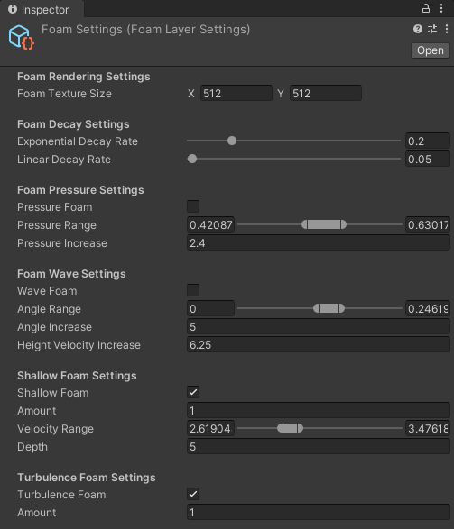

#### Foam Render Settings

| Property | Description |
| :--- | :--- |
| Texture Size | The resolution of the generated foam mask texture.<br/><br/>Higher resolutions provide sharper foam details but require more memory and GPU processing power. It is generally recommended to match the aspect ratio of the fluid simulation grid. |

#### Foam Decay Settings

| Property | Description |
| :--- | :--- |
| Exponential Decay Rate | The rate at which pressure-based foam decays exponentially per frame.<br/><br/>Higher values cause the foam to dissipate more rapidly. This affects foam generated by the pressure system. |
| Linear Decay Rate | The constant amount of pressure-based foam subtracted from the mask per frame (Linear Decay). |

#### Foam Pressure Settings

| Property | Description |
| :--- | :--- |
| Apply Pressure Foam | Toggles the generation of foam based on internal fluid pressure.<br/><br/>Note: This feature is strictly for use with [Flux Fluid Simulation](#flux-fluid-simulation). The alternative [Flow Fluid Simulation](#flow-fluid-simulation) does not calculate internal pressure fields, so enabling this will have no effect in that mode. |
| Pressure Range | Defines the pressure threshold range for foam generation.<br/><br/>-  **X (Min)**  Pressure values below this threshold generate no foam.  <br/>-  **Y (Max)**  Pressure values above this threshold generate the maximum amount of foam.   Intermediate values are interpolated using Smoothstep. |
| Pressure Increase Amount | The rate at which foam accumulates per frame when fluid pressure exceeds the [Pressure Range](#pressure-range) minimum. |

#### Foam Wave Settings

| Property | Description |
| :--- | :--- |
| Apply Wave Foam | Toggles the generation of foam based on wave geometry (height and steepness).<br/><br/>This system simulates whitecaps and crest foam caused by turbulent or high-amplitude waves. |
| Wave Angle Range | Defines the wave surface angle (steepness) thresholds for foam generation.<br/><br/>-  **X (Min)**  Wave angles below this value generate no foam.  <br/>-  **Y (Max)**  Wave angles above this value generate maximum foam.   Intermediate values are interpolated using Smoothstep. |
| Wave Angle Increase Amount | The amount of foam added per frame when the wave angle exceeds the [Wave Angle Range](#wave-angle-range) minimum. |
| Wave Height Increase Amount | The amount of foam added per frame based on the vertical (Y) velocity of the fluid surface.<br/><br/>This simulates foam generated by rapidly rising water, such as splashes or chaotic wave peaks. |

#### Shallow Foam Settings

| Property | Description |
| :--- | :--- |
| Apply Shallow Foam | Toggles the generation of foam in shallow water areas where fluid velocity is high.<br/><br/>This is useful for simulating shorelines or river rapids where water churns against the ground. |
| Shallow Foam Amount | The maximum intensity of foam added when the shallow water criteria are met. |
| Shallow Velocity Range | Defines the velocity range required to generate foam in shallow water.<br/><br/>-  **X (Min)**  Fluid speeds below this value generate no foam, even if the water is shallow.  <br/>-  **Y (Max)**  Fluid speeds above this value generate maximum foam.   Intermediate values are interpolated using Smoothstep. |
| Shallow Depth | The depth threshold for shallow water foam.<br/><br/>Foam will only be generated in areas where the fluid depth is less than this value (and velocity requirements are met). |

#### Turbulence Foam Settings

| Property | Description |
| :--- | :--- |
| Apply Turbulence Foam | Toggles the generation of foam based on velocity gradients (turbulence).<br/><br/>Calculates foam based on the curl or difference in velocity vectors between adjacent cells. |
| Turbulence Foam Amount | The intensity multiplier for foam generated by turbulence. |
| Turbulence Foam Threshold | The minimum turbulence value required to begin generating foam. |

___

<a name="flowmapping"></a>
### Fluid Flow Mapping

**Fluid Flow Mapping** is an extension layer that enables and controls [*flow mapping*](https://catlikecoding.com/unity/tutorials/flow/directional-flow/) functionality in the simulation and rendering side of Fluid Frenzy. The layer generates the *flow map* procedurally using the flow of the fluid simulation. The rendering data is automatically passed to the material assigned to the [Fluid Renderer](#fluid-rendering-components). There are several settings to control the visuals of the flow mapping in the layer which can be set in the [Fluid Flow Mapping Settings](#flowmap-settings) asset assigned to this layer.

- **Settings** - a [Fluid Flow Mapping Settings](#flowmap-settings) asset which holds the settings to be used for this Flow Mapping Layer

<a name="flowmap-settings"></a>
### Fluid Flow Mapping Settings

A [Scriptable Object](#scriptable-object) asset containing configuration parameters for [Fluid Flow Mapping](#fluid-flow-mapping).

Using a settings asset allows for easy reuse and centralized modification of flow mapping behaviors across multiple simulation instances. 

 To create a new settings asset, navigate to: `Assets > Create > Fluid Frenzy > Flow Mapping Settings`.

 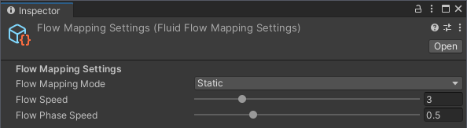

| Property | Description |
| :--- | :--- |
| Flow Mapping Mode | Defines the technique used to render the fluid's surface flow and texture advection.<br/><br/>-  **`Off`**  No flow mapping is applied.  <br/>-  **`Static`**  Flow mapping is performed directly in the shader by offsetting UV coordinates based on the instantaneous velocity field.  <br/>-  **`Dynamic`**  Utilizes a separate simulation buffer to calculate UV offsets. The UVs are advected over time, similar to the velocity field and foam mask. This allows for complex swirling effects but may accumulate distortion over longer periods. |
| Flow Speed | A multiplier applied to the velocity vectors when calculating UV offsets.<br/><br/>Higher values create the appearance of faster-moving fluid but increase the visual distortion (stretching) of the surface texture. |
| Flow Phase Speed | Controls the frequency at which the flow map cycle resets to its original UV coordinates.<br/><br/>Continuous advection eventually distorts textures beyond recognition. To prevent this, the system resets the UVs periodically. <br/><br/> Increasing this value makes the reset occur more frequently, reducing maximum distortion. To hide the visual "pop" during a reset, the texture is sampled multiple times with offset phases and blended based on this cycle speed. |

___

<a name="erosion-layer"></a>
### Erosion Layer

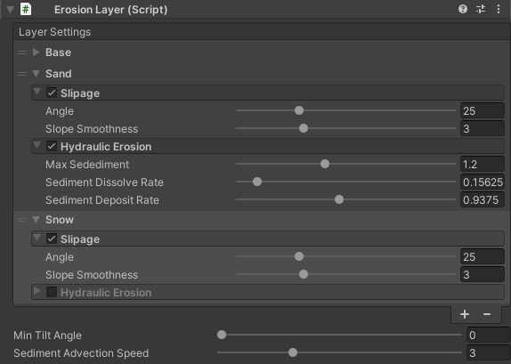

The [Erosion Layer](#erosion-layer) is an extension layer for the [Fluid Simulation](#fluid-simulation) that simulates physically-based `hydraulic erosion, slope-based slippage, and terrain modification` based on the fluid's state and terrain slope.

The `Erosion Layer` is a texture-based system that analyzes the fluid simulation's state (fluid height and velocity) and the terrain's geometry to dynamically modify the ground. Modifications are applied directly to the associated terrain input (e.g., `SimpleTerrain` or `TerraformTerrain`) and fed back into the simulation to affect fluid flow.  

#### Multi-Layer Terrain System

 The erosion system allows you to define up to `four distinct terrain layers`, each with its own properties (e.g., hardness, color). The layers are structured from the bottom up:  
- **Layer Structure** The first element (Layer 0) represents the bottom-most layer (e.g., bedrock), and each subsequent element represents the material stacked on top. 
- **User Clarity** For clarity in the editor, you can give each layer a custom name (e.g., "Rock," "Soil," or "Snow") to help keep track of what it represents.   


#### Terrain Modification Processes

##### 1. Hydraulic Erosion (Water-Based)

 This process converts terrain material into **sediment** using two-dimensional textures, driven by the fluid's velocity field.  
-  **Erosion** Higher fluid velocity removes terrain material from the heightmap and transfers it into a Sediment Map.  
-  **Transport** The Sediment Map is continuously updated and advected (moved) across the grid according to the fluid's velocity field.  
-  **Deposition** Sediment is redeposited back onto the terrain heightmap in areas where the fluid flow is slower.    

##### 2. Slope-Based Slippage

 This process simulates gravity-driven effects (like landslides and thermal erosion). Material is removed and shifted to lower areas wherever the terrain's slope angle exceeds a configurable threshold (the material's angle of repose), helping to smooth steep cliffs over time.

| Property | Description |
| :--- | :--- |
| Terrain Layer | Identifies specific vertical layers within the terrain structure. |
| Terrain Layer Mask | A bitmask used to select multiple [Terrain Layer](#terrain-layer)s simultaneously. |
| Splat Channel | Identifies a specific color channel in a texture or splatmap. |
| Slippage | Toggles material slippage.<br/><br/>When enabled, material on steep slopes will naturally slide down to lower areas, smoothing the terrain over time. |
| Slippage Angle | The angle limit for slopes, in degrees.<br/><br/>Terrain slopes steeper than this angle will trigger slippage, causing material to slide down. |
| Slope Smoothness | Controls the intensity of the slippage effect.<br/><br/>Higher values result in more aggressive smoothing of slopes that exceed the [Slippage Angle](#slippage-angle). |
| Hydraulic Erosion | Toggles hydraulic erosion.<br/><br/>When enabled, moving fluid will wear down the terrain and transport sediment based on velocity and turbulence. |
| Max Sediment | The maximum amount of sediment a fluid cell can carry.<br/><br/>Once the sediment carried by the fluid reaches this limit, no further erosion will occur in that cell until material is deposited elsewhere. |
| Sediment Dissolve Rate | The rate at which solid terrain is picked up by the fluid.<br/><br/>Higher values cause the terrain to erode faster, provided the fluid has not reached its [Max Sediment](#max-sediment) capacity. |
| Sediment Deposit Rate | The rate at which carried sediment settles back onto the terrain.<br/><br/>Deposition occurs when the fluid slows down or when the carried material exceeds the capacity defined by [Max Sediment](#max-sediment). |
| Min Tilt Angle | Defines the minimum slope angle required for full hydraulic erosion efficiency.<br/><br/>This value modulates erosion based on the terrain's tilt.  <br/>-  **0 Degrees**  No restriction. Flat surfaces erode at the same rate as slopes.  <br/>-  **High Degrees**  Limits erosion primarily to steeper slopes, preserving flat areas. |
| Sediment Advection Speed | The speed at which sediment moves with the fluid flow.<br/><br/>Higher values transport material further across the world before it deposits. <br/><br/> Note: Because the erosion simulation is not strictly mass-conserving, very high speeds may cause sediment to "vanish" if it moves into cells with no fluid or off the edge of the simulation grid. |
| High Precision Advection | Toggles a higher-fidelity movement calculation for sediment.<br/><br/>When enabled, the simulation uses a more accurate method to move sediment. This prevents sediment from artificially fading away due to calculation errors but increases the GPU performance cost. |
| [Layer Settings](#erosion-settings) | A list of erosion configurations, allowing different physical properties to be applied to different terrain layers. |

<a name="erosion-settings"></a>
### Erosion Settings

Converts a [Terrain Layer Mask](#terrain-layer-mask) into a vector representation for shader operations.

| Property | Description |
| :--- | :--- |
| Name | The display name for this settings entry. |
| Slippage | Toggles material slippage.<br/><br/>When enabled, material on steep slopes will naturally slide down to lower areas, smoothing the terrain over time. |
| Slippage Angle | The angle limit for slopes, in degrees.<br/><br/>Terrain slopes steeper than this angle will trigger slippage, causing material to slide down. |
| Slope Smoothness | Controls the intensity of the slippage effect.<br/><br/>Higher values result in more aggressive smoothing of slopes that exceed the [Slippage Angle](#slippage-angle). |
| Hydraulic Erosion | Toggles hydraulic erosion.<br/><br/>When enabled, moving fluid will wear down the terrain and transport sediment based on velocity and turbulence. |
| Max Sediment | The maximum amount of sediment a fluid cell can carry.<br/><br/>Once the sediment carried by the fluid reaches this limit, no further erosion will occur in that cell until material is deposited elsewhere. |
| Sediment Dissolve Rate | The rate at which solid terrain is picked up by the fluid.<br/><br/>Higher values cause the terrain to erode faster, provided the fluid has not reached its [Max Sediment](#max-sediment) capacity. |
| Sediment Deposit Rate | The rate at which carried sediment settles back onto the terrain.<br/><br/>Deposition occurs when the fluid slows down or when the carried material exceeds the capacity defined by [Max Sediment](#max-sediment). |

<a name="terraform-layer"></a>
### Terraform Layer

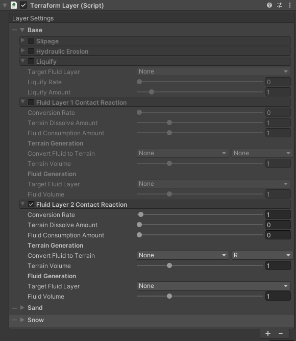

The [Terraform Layer](#terraform-layer) is an advanced extension of the [Erosion Layer](#erosion-layer) that enables dynamic **terrain synthesis and multi-fluid interaction** (e.g., "God game" mechanics) by simulating complex layer transformations.

The `Terraform Layer` extends the base erosion system by adding highly customizable rules for material transformation between fluid and terrain layers. This facilitates complex real-time behaviors like fluid mixing, liquefaction, and contact-based reactions that modify both the terrain heightmap and splatmap.  

#### Liquefaction (Solid Terrain to Fluid)

 This feature allows a terrain layer (e.g., snow or ice) to dissolve into a selected fluid layer (e.g., water) over time. You can configure the `Liquify Rate` and the `Liquify Amount` (conversion ratio of terrain height to fluid depth) independently for each terrain layer.  

#### Fluid Contact Reactions (Fluid and Terrain)

 This system allows each terrain layer to react specifically when it comes into contact with any of the fluid layers. Reactions can be configured to:  
- **Dissolve** Consume the terrain and/or the fluid over time. 
- **Convert** Change the terrain into a new terrain layer (with a new splat channel) or convert the terrain into a different fluid layer (e.g., snow reacting to `Lava` to create `Water`). 
- **Volume Control** Adjust the `Terrain Volume` and `Fluid Volume` multipliers to simulate material expansion or compression during the transformation.   

#### Fluid Mixing (Fluid + Fluid to Solid Terrain)

 When two different fluid layers occupy the same cell, this system can be triggered to simulate a reaction (e.g., water and lava mixing to cool and solidify into rock).  
- **Solidification** The mixing fluids are consumed and deposited as a new, solid terrain layer onto the heightmap and splatmap. 
- **Particle Emission** The system can emit visual particles (e.g., steam) upon mixing, with customizable settings for `Emission Rate`, color, and lifetime.   

 `Setup Note:` While this component must be attached to a GameObject, it also requires registration in the [Extension Layers](#extension-layers) list to function correctly.

| Property | Description |
| :--- | :--- |
| Fluid Mixing | Toggles the interaction logic between overlapping fluid types.<br/><br/>When enabled, if two distinct fluids (e.g., Water and Lava) occupy the same grid cell, they will trigger a mixing event. In standard configurations, this results in the fluid volume being consumed and converted into solid terrain geometry. |
| Fluid Mix Rate | Controls the speed of the reaction between interacting fluids.<br/><br/>Higher values cause the fluids to consume each other and generate terrain more rapidly. |
| Fluid Mix Scale | The volumetric conversion ratio between consumed fluid and generated terrain.<br/><br/>This value determines how much solid ground is created for every unit of fluid lost during mixing.  <br/>-  **1.0**  One unit of fluid volume converts exactly to one unit of terrain volume.  <br/>-  **Greater than 1.0**  The reaction expands, creating more terrain than the fluid consumed.  <br/>-  **Less than 1.0**  The reaction contracts, creating less terrain than the fluid consumed. |
| Deposit Rate | The rate at which the newly solidified material is integrated into the terrain's heightmap.<br/><br/>While [Fluid Mix Rate](#fluid-mix-rate) controls the fluid consumption, this controls the visual rise of the ground. Lower values can smooth out the generation process, preventing abrupt spikes in the terrain mesh. |
| Deposit Terrain Layers | Specifies which vertical terrain layer (e.g., Bedrock or Sediment) receives the newly generated geometry. |
| Deposit Terrain Splat | Specifies the material channel (R, G, B, or A) in the splatmap to apply to the newly generated terrain.<br/><br/>This ensures that the new ground visually matches the expected material (e.g., setting the channel to display "Obsidian" or "Rock" texture where lava hardened). |
| [Fluid Particles](#fluid-particle-system) | Configuration for the particle system emitted during fluid mixing events.<br/><br/>This is commonly used to create steam or smoke effects when hot fluids interact with cool fluids (e.g., Lava meeting Water). |
| Emission Rate | The time interval, in seconds, between consecutive particle spawn events at a mixing location.<br/><br/>A lower value results in a higher frequency of particle emission (more particles), while a higher value results in sparse emission. |

<a name="fluid-contact-reaction"></a>
#### Fluid Contact Reaction

Defines the changes that occur when a specific terrain layer comes into contact with fluid.

This class acts as a "recipe" for interactions, such as Lava turning Grass into Rock (scorching) or Water turning Soil into Mud.

| Property | Description |
| :--- | :--- |
| Enabled | Toggles this specific contact reaction. |
| Conversion Rate | The global speed multiplier for this reaction.<br/><br/>Defines how fast the transition happens in units per second. Higher values result in near-instant transformations. |
| Terrain Dissolve Amount | The amount of solid terrain removed per second while in contact with the fluid.<br/><br/>Use this to simulate the terrain being "eaten away" or dissolved by the fluid. |
| Fluid Consumption Amount | The amount of fluid volume consumed per second during the reaction.<br/><br/>Use this to simulate fluid evaporating (e.g., lava cooling on rock) or soaking into the ground. |
| Convert To Terrain Layer | The target terrain layer that the original terrain will transform into.<br/><br/>For example, if Water touches a "Dirt" layer, you might set this to a "Mud" layer. |
| Convert To Splat Channel | The visual texture (splat channel) applied to the transformed terrain.<br/><br/>This updates the terrain's appearance to match its new physical properties (e.g., turning green grass texture into grey rock). |
| Convert To Terrain Volume | The volumetric conversion ratio for generating new terrain.<br/><br/>Determines how much new solid ground is created relative to the amount consumed.  <br/>-  **1.0**  One unit of consumed terrain becomes exactly one unit of new terrain.  <br/>-  **Greater than 1.0**  The reaction expands, creating more terrain volume than was consumed. |
| Convert To Fluid Layer | The target fluid layer to generate when the terrain dissolves.<br/><br/>Use this for reactions where solid ground turns into liquid, such as Lava melting Ice into Water. |
| Convert To Fluid Volume | The volumetric conversion ratio for generating new fluid.<br/><br/>Determines how much liquid is produced relative to the amount of terrain dissolved.  <br/>-  **1.0**  One unit of terrain height becomes one unit of fluid depth.  <br/>-  **Greater than 1.0**  The reaction expands, creating more fluid volume than the terrain that was dissolved. |

<a name="terraform-settings"></a>
#### Terraform Settings

An extended configuration profile for the [Terraform Layer](#terraform-layer), including standard erosion settings and advanced contact interactions.

| Property | Description |
| :--- | :--- |
| Liquify | Toggles the automatic "liquefaction" of this terrain layer over time, independent of fluid contact.<br/><br/>Useful for simulating unstable materials like melting snow or ice that naturally turns into fluid. |
| Liquify Layer | The target fluid layer (e.g., Layer 1, Layer 2) that this terrain layer dissolves into when [Liquify](#liquify) is enabled. |
| Liquify Rate | The speed at which the terrain naturally dissolves into fluid, in units of height per second. |
| Liquify Amount | The volumetric conversion ratio of terrain height to fluid depth during liquefaction.<br/><br/>-  **1.0**  1 unit of terrain height becomes 1 unit of fluid depth.  <br/>-  **2.0**  1 unit of terrain produces 2 units of fluid. |
| [Fluid Layer1Contact](#fluid-contact-reaction) | Defines the reaction rules applied when this terrain layer comes into contact with Fluid Layer 1. |
| [Fluid Layer2Contact](#fluid-contact-reaction) | Defines the reaction rules applied when this terrain layer comes into contact with Fluid Layer 2. |

<a name="terrain-modifier"></a>
### Terrain Modifier
[Terrain Modifier](#terrain-modifier) is a component used to interactively modify the underlying terrain heightfield within the [Fluid Simulation](#fluid-simulation).

This component acts as a "brush" for precise terrain editing, allowing you to raise, lower, or set the height of the solid ground layer. It is ideal for dynamic world sculpting or in-game level editing.  

 **Note:** This component requires and works in conjunction with a specialized terrain system on the [Fluid Simulation](#fluid-simulation), such as the `TerraformLayer` or `ErosionLayer` and the `Simple/TerraformTerrain` types, to enable terrain height modifications.  

 The modification effect is defined by the [Terrain Modifier Settings](#terrain-modifier-settings) and applied within a localized area determined by the selected [Terrain Input Mode](#terrain-input-mode) and [Size](#size).

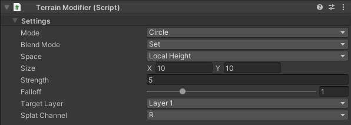

<a name="terrain-modifier-settings"></a>
#### Terrain Modifier Settings

| Property | Description |
| :--- | :--- |
| Mode | Defines the shape or source of the modification brush.<br/><br/>Input modes include:  <br/>-  **[Circle](#circle)**  The brush applies the modification within a circular area.  <br/>-  **[Box](#box)**  The brush applies the modification within a rectangular area.  <br/>-  **[Texture](#texture)**  The brush uses a source texture to define the shape and intensity. |
| Blend Mode | Defines the mathematical operation used to apply the modification to the terrain.<br/><br/>This determines how the modification is applied to the terrain. Options include:  <br/>-  **[Additive](#additive)**  Raising or lowering the height over time.  <br/>-  **[Set](#set)**  Setting the height to a specific value.  <br/>-  **[Minimum](#minimum)/[Maximum](#maximum)**  Clamping the height to the target value. |
| Space | Specifies the coordinate space used for height modifications.<br/><br/>-  **[World Height](#world-height)**  The height is interpreted as a specific world Y-coordinate.  <br/>-  **[Local Height](#local-height)**  The height is interpreted relative to the base terrain height. |
| Strength | Controls the magnitude or intensity of the terrain deformation.<br/><br/>- For Additive blending, this is the amount of height to add/subtract *per second*.<br/> - For Set, Minimum, or Maximum blending, this value contributes to the target height. |
| Remap | Adjust the range used to remap the normalized input value (e.g., from a texture) to the final output strength.<br/><br/>A normalized input of 0 is mapped to `remap.x`, and an input of 1 is mapped to `remap.y`. |
| Falloff | Adjust the softness of the brush edge (falloff) for the Circle and Box input modes.<br/><br/>Higher values create a wider and softer transition at the modification boundary. |
| Size | Adjust the size (width and height) of the modification area in world units. |
| Layer | Specifies the target terrain layer (e.g., a specific heightmap channel) to modify.<br/><br/>Typically used to select between the channels of a multi-channel heightmap, such as channel 0 for Red and 1 for Green. |
| Splat | Specifies the target splatmap channel to use when the blend mode involves a terrain splatmap.<br/><br/>Used to select a specific texture layer for blending (e.g., channel 0 for Red, 1 for Green, etc.). |
| Texture | The source texture used to define the modification shape and intensity when [Mode](#mode) is set to [Texture](#texture). |

<a name="terraform-modifier"></a>
### Terraform Modifier

[Terraform Modifier](#terraform-modifier) is a component used to interactively modify both the terrain and fluid layers within the [Fluid Simulation](#fluid-simulation).

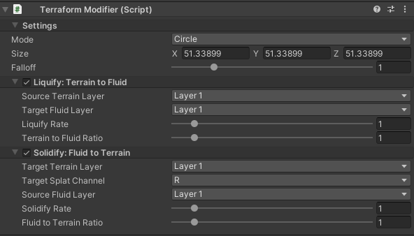

This component acts as a "brush" to simulate the transformation of material layers between solid ground and liquid fluid. It enables real-time interactive effects, such as melting snow/ice (`liquify`) into water or the water into snow (`solidify`), making it ideal for "God games" or complex world interaction scenarios.

**Note:** This component requires and works in conjunction with the `TerraformLayer` (or a similar erosion/terrain modification system) on the [Fluid Simulation](#fluid-simulation) to enable the material transformation process.

The modification effect is defined by the [Terraform Modifier Settings](#terraform-modifier-settings) and applied within a localized area determined by the selected **Terraform Input Mode** and size.

<a name="terraform-modifier-settings"></a>
##### Terraform Modifier Settings

| Property | Description |
| :--- | :--- |
| Mode | Set the shape of the modification brush (Circle, Box, Sphere, Cube, Cylinder, Capsule). |
| Size | Adjust the dimensions of the modification area in world units. Interpretation varies by mode (e.g., Circle uses X for radius, Box uses X/Z for width/depth). |
| Falloff | Adjust the sharpness of the brush edge. Higher values create a softer edge. |
| Liquify | If enabled, the modifier will attempt to dissolve terrain into fluid (liquify). |
| Source Terrain Layer | Set the terrain layer (e.g. Layer 1, Layer 2) that will be dissolved. |
| Target Fluid Layer | Set the fluid layer (e.g., Layer 1, Layer 2) that this terrain will dissolve into. |
| Liquify Rate | Set the speed at which the terrain dissolves into fluid, in units of height per second. Higher values mean faster melting or dissolving.. |
| Liquify Amount | Set the conversion ratio of terrain height to fluid depth. A value of 1 means 1 unit of terrain<br/>height becomes 1 unit of fluid depth. A value of 2 means 1 unit of terrain becomes 2 units of fluid. |
| Solidify | If enabled, the modifier will attempt to solidify fluid into terrain. |
| Target Terrain Layer | Set the terrain layer (e.g. Layer 1, Layer 2) that will be built up. |
| Target Splat Channel | Set the splat channel (e.g., R, G, B, A) that will be used to paint the built-up terrain. |
| Source Fluid Layer | Set the fluid layer (e.g., Layer 1, Layer 2) that will be consumed to create terrain. |
| Solidify Rate | Set the speed at which the fluid solidifies into terrain, in units of height per second. Higher values mean faster build-up of terrain. |
| Fluid to Terrain Ratio | Set the conversion ratio of fluid depth to terrain height. A value of 1 means 1 unit of fluid<br/>depth becomes 1 unit of terrain height. A value of 2 means 2 units of fluid become 1 unit of terrain. |


<a name="particle-generator"></a>
### Fluid Particle Generator
<sub>**This functionality is subject to future changes.**</sub>

[Fluid Particle Generator](#fluid-particle-generator) is an [Fluid Layer](#fluid-layer) extension that analyzes the fluid simulation's dynamics to spawn and manage visual particle effects for foam and spray.

This component generates two distinct types of particles by detecting areas of high turbulence and breaking waves within the fluid simulation:   
-  **Splash Particles (Spray/Droplets)**  Ballistic particles spawned at high-energy events (e.g., breaking waves, collisions). These particles inherit the fluid's velocity at the moment of spawn and follow a physical trajectory (like spray or droplets) until their lifetime expires.  
-  **Surface Particles (Foam/Bubbles)**  Particles spawned on top of the fluid surface, primarily in areas of high turbulence. They are continuously advected (moved) by the simulation's velocity field, acting as a visual representation of sea foam or churn. These particles can often be rendered to an off-screen buffer for use as a `foam mask` in the water shader.

#### Splash Particles

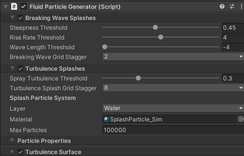

| Property | Description |
| :--- | :--- |
| Breaking Wave Splashes | Toggles the emission of splash particles from cresting or breaking waves. |
| Steepness Threshold | The minimum surface angle (steepness) required to trigger a splash.<br/><br/>Higher values restrict splashes to only the sharpest peaks of the waves. |
| Rise Rate Threshold | The minimum vertical (upward) velocity required to trigger a splash.<br/><br/>Used to identify waves that are rising rapidly before they break. |
| Wave Length Threshold | The minimum physical length a wave must have to emit particles.<br/><br/>Helps prevent small, high-frequency noise from generating excessive spray. |
| Breaking Wave Grid Stagger | Optimization setting that spreads the sampling of grid cells for breaking waves across multiple frames.<br/><br/>A value of 2 means a specific cell is checked every 2nd frame. Increasing this value reduces the number of particles spawned and lowers performance cost, but may make emission look less responsive. |
| Turbulence Splashes | Toggles the emission of spray particles from areas of high turbulence (diverging velocities). |
| Turbulence Splash Grid Stagger | Optimization setting that spreads the sampling of grid cells for turbulence splashes across multiple frames. |
| Spray Turbelence Threshold | The minimum turbulence value required to trigger a splash particle. |
| [Splash Particle System](#fluid-particle-system) | Configuration settings for the ballistic splash particles (movement, rendering, and limits). |

##### Particle System
| Property | Description |
| :--- | :--- |
| Update Mode | Defines the execution strategy for the particle update loop. |
| Max Particles | The maximum number of particles that can be active simultaneously in the simulation buffer.<br/><br/>This value determines the size of the GPU [Graphics Buffer](#graphics-buffer) allocated for the system. Increasing this allows for denser effects but increases VRAM usage and GPU processing cost. |
| Material | The material used to render the particle geometry.<br/><br/>Requirement: The assigned material must use a shader capable of procedural instantiation, such as the included `ProceduralParticle` or `ProceduralParticleUnlit` shaders. |
| Layer | The Unity Layer index assigned to the rendered particles.<br/><br/>This is used to control visibility via Camera Culling Masks, allowing specific cameras (e.g., UI or reflection probes) to ignore these particles. |

#### Surface Particles

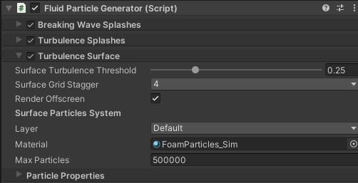

| Property | Description |
| :--- | :--- |
| Turbulence Surface | Toggles the emission of surface particles (foam) in turbulent areas.<br/><br/>Unlike splashes, these particles stick to the fluid surface and move with the flow. |
| Surface Turblence Threshold | The minimum turbulence value required to trigger a surface particle. |
| Surface Grid Stagger | Optimization setting that spreads the sampling of grid cells for surface particles across multiple frames. |
| [Surface Particles System](#fluid-particle-system) | Configuration settings for the advected surface particles (movement, rendering, and limits). |
| Render Offscreen | If enabled, surface particles are rendered to a dedicated offscreen texture buffer instead of the main camera.<br/><br/>This generated texture is globally available to shaders (e.g., as a foam mask) to create effects like white water trails without drawing individual particle geometry to the screen. |

##### Particle System
| Property | Description |
| :--- | :--- |
| Update Mode | Defines the execution strategy for the particle update loop. |
| Max Particles | The maximum number of particles that can be active simultaneously in the simulation buffer.<br/><br/>This value determines the size of the GPU [Graphics Buffer](#graphics-buffer) allocated for the system. Increasing this allows for denser effects but increases VRAM usage and GPU processing cost. |
| Material | The material used to render the particle geometry.<br/><br/>Requirement: The assigned material must use a shader capable of procedural instantiation, such as the included `ProceduralParticle` or `ProceduralParticleUnlit` shaders. |
| Layer | The Unity Layer index assigned to the rendered particles.<br/><br/>This is used to control visibility via Camera Culling Masks, allowing specific cameras (e.g., UI or reflection probes) to ignore these particles. |

<a name="fluid-rigidbody"></a>
### Fluid RigidBody

Enables high-fidelity, two-way physics coupling between a [Rigidbody](#rigidbody) and a [Fluid Simulation](#fluid-simulation)'s heightfield grid, allowing the body to be affected by the fluid and to generate displacement, wakes, and splashes.

The component performs geometry-to-fluid interaction using an optimized system that leverages **Unity Jobs** for multithreaded performance.  

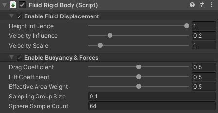

#### Prerequisite
 
 To allow the CPU to access the fluid height for buoyancy calculations, the [Read Back Height](#read-back-height) (`CPU Height Read`) setting must be enabled on the [Fluid Simulation](#fluid-simulation).  

#### Fluid Density Calibration

 To ensure objects float correctly, the global fluid density setting, accessed via [Fluid Density](#fluid-density), must be calibrated to match your project's physics scale (where mass and size often do not follow real-world proportions).  

 If Rigidbodies (e.g., a vehicle with a mass of 1500) sink when they should float, the fluid density is likely too low for that mass magnitude. A good starting point is to set the [Fluid Density](#fluid-density) value to be similar to the mass of an average-sized object you expect to float.  

#### Interaction Calculation
  
-  **Fluid to Solids Coupling (Forces)**   The component calculates and applies realistic forces to the object's [Rigidbody](#rigidbody). Forces are determined by analyzing the volume and state of the body's submerged **sub-triangulated geometry** against the fluid's state. These include:  `Buoyancy`: Calculated from the weight of the displaced fluid, based on the submerged volume. `Drag and Lift`: Applied based on the relative velocity of the body to the fluid.    
-  **Solids to Fluid Coupling (Displacement)**   The object's movement displaces the fluid, generating wakes and splashes. This is calculated by applying the volume and velocity changes of the submerged sub-triangles to the fluid's closest `height field` and `velocity grid cells`. The effect is decayed exponentially with increasing distance from the surface.   
-  **Requirements and Limitations**   The component requires a [Rigidbody](#rigidbody) and a supported [Collider](#collider), such as [Mesh Collider](#mesh-collider), [Sphere Collider](#sphere-collider), [Box Collider](#box-collider), or [Capsule Collider](#capsule-collider), on the same GameObject. This component is `not compatible with WebGL` due to its reliance on compute shaders.

| Property | Description |
| :--- | :--- |
| Apply Fluid Displacement | A toggle for the solid-to-fluid interaction. If true, this object will displace the fluid, creating splashes and wakes. |
| [Displacement Profile](#fluid-displacement-profile) | A profile containing the detailed physics parameters that control how this object displaces the fluid (e.g., wave height, current strength). |
| Subdivision Area Threshold | The area threshold used to recursively subdivide a MeshCollider's triangles for the solid-to-fluid displacement pass.<br/><br/>Each triangle of the source mesh is checked against this value. If its area is larger, it is recursively split into four smaller sub-triangles until all resulting triangles are below this area. This creates a higher-density representation of the mesh, leading to more accurate and detailed fluid displacement (splashes and wakes). Lowering this value increases visual quality at the cost of higher memory usage (for the GraphicsBuffer) and GPU processing time. |
| Apply Fluid Forces To Rigibody | A toggle for the fluid-to-solid interaction. If true, the fluid will apply forces like buoyancy, drag, and lift to this object's Rigidbody. |
| Center Of Mass Offset | The custom center of mass for the Rigidbody ofset, calculated in local space.<br/><br/>By default, a Rigidbody's center of mass is at its geometric center, which is often too high for a boat, making it "top-heavy" and prone to capsizing in turns or rough water. By setting a negative Y value, you can artificially lower the center of mass, making the object "bottom-heavy." This creates a strong restoring torque that resists rolling and keeps the object upright, similar to the keel on a real boat. |
| [Interaction Profile](#fluid-interaction-profile) | A profile containing the detailed physics parameters that control how the fluid affects this object (e.g., drag and lift coefficients). |
| Sampling Group Size | The size of the grid cells used to group the object's surface points for optimization.<br/><br/>A performance tuning parameter that groups the object's surface points into a grid for optimized fluid sampling. Smaller values increase accuracy at a potential performance cost. A good starting value roughly matches the cell size of the fluid simulation. |
| Sphere Sample Count | The total number of sample points to generate on the surface of a SphereCollider for the fluid-to-solid (buoyancy) calculations. |
| Box Face Sample Count | The number of sample points to generate along each axis of a BoxCollider's face. For example, a value of 8 will create an 8x8 grid of points on each of the 6 faces. |
| Capsule Sample Count | The total number of sample points to generate on the surface of a CapsuleCollider, distributed proportionally across its cylindrical body and hemispherical caps. |

<a name="fluid-displacement-profile"></a>
#### Fluid Displacement Profile

A container for the physics coefficients that define how a solid object displaces and applies forces TO the fluid simulation. This controls the "splash" and "wake" created by the object.

| Property | Description |
| :--- | :--- |
| Height Influence | Controls how strongly the object's volume displaces the water's height. This is the primary factor in determining the size of waves generated by the object.<br/><br/>A higher value will cause the object to create larger waves and splashes upon impact, making it feel like it's displacing more water. A value of 0 would mean the object slices through the water without changing its height at all. |
| Velocity Influence | Controls how much of the object's velocity is transferred to the water, creating currents and wakes.<br/><br/>A higher value will cause the object to "drag" the water along with it more effectively, creating stronger currents in its wake. A value of 0 would mean the object moves through the water without affecting its velocity. |
| Velocity Scale | A multiplier that scales the velocity deltas. This acts as a global artistic control for the object's overall displacement.<br/><br/>This is a non-physical parameter useful for tuning the visual impact. You can use it to exaggerate or dampen an object's effect without altering the more physically-based ratio between its height and velocity displacement. |

<a name="fluid-interaction-profile"></a>
#### Fluid Interaction Profile

A container for the physics coefficients that define how a Rigidbody is affected by fluid forces (drag, lift).

| Property | Description |
| :--- | :--- |
| Drag Coefficient | The drag coefficient (CD), representing how much the fluid resists the object's motion through it. This is a dimensionless number that models the "thickness" or resistance of the fluid.<br/><br/>A higher value increases resistance, making the object feel like it's moving through a thicker substance (e.g., mud or honey). A lower value reduces resistance, making the object feel lighter and more slippery. |
| Lift Coefficient | The lift coefficient (CL), representing the force generated perpendicular to the direction of fluid flow. This models how a surface's shape can act like a wing or a spoiler in the water.<br/><br/>This can create an upward force (like on a hydrofoil) or a downward force (like a spoiler on a race car) depending on the surface's angle relative to the flow. It's crucial for simulating dynamic, unstable behavior. |
| Effective Area Weight | The weighting factor that blends between using the full surface area and the projected area that directly faces the fluid flow.<br/><br/>A value of 0 means the object's orientation to the flow doesn't matter; it experiences the same drag from all sides. A value of 1 means only the surface area directly facing the flow contributes, making the object highly sensitive to its angle. A value of 0.5 provides a balanced mix. |

<a name="fluid-rigidbody-lite"></a>
### Fluid RigidBody Lite

[Fluid Rigid Body Lite](#fluid-rigid-body-lite) is a lightweight component for simplified interaction between a [Rigidbody](#rigidbody) and the [Fluid Simulation](#fluid-simulation).

This component applies physics effects such as buoyancy, drag, and advection (movement by the current), and allows the object to generate visual wave and splash effects on the fluid surface. It is designed for performance with minimal setup.  

 **Requirement:** This component requires both a [Rigidbody](#rigidbody) and a [Collider](#collider) to be attached to the [Game Object](#game-object).  

 **Prerequisite:** To allow the CPU to access the fluid height for buoyancy calculations, the [Read Back Height](#read-back-height) (`CPU Height Read`) setting must be enabled on the [Fluid Simulation](#fluid-simulation).

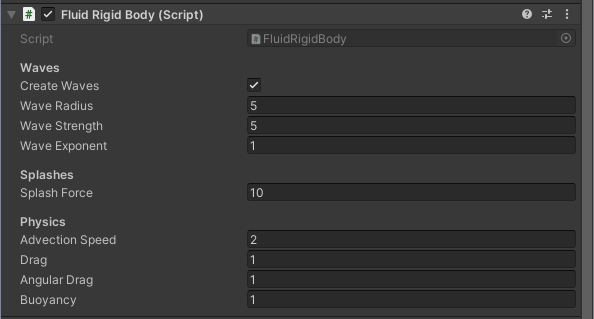

##### Waves

| Property | Description |
| :--- | :--- |
| Create Waves | If enabled, the object will interact with the fluid simulation by creating waves in its direction of movement (e.g., wakes). |
| Wave Radius | Adjusts the radius (size) of the generated wave/wake on the fluid surface. |
| Wave Strength | Adjusts the height (amplitude) or intensity of the wave. |
| Wave Exponent | Adjusts the falloff curve of the wave's strength. Higher values mean a faster falloff, which can be used to create sharper or flatter wave/vortex shapes. |

##### Splashes

| Property | Description |
| :--- | :--- |
| Create Splashes | If enabled, the object will interact with the fluid simulation by generating splashes when falling into the fluid. |
| Splash Force | Adjusts the force applied to the fluid simulation when the object lands in the fluid. Faster falling objects create bigger splashes. |
| Splash Radius | Adjusts the size of the splash area on the fluid surface. |
| Splash Time | Adjusts the time duration over which the splash force is applied while surface contact is made. |
| [Splash Particles](#splash-particle-system) | A list of [Splash Particle System](#splash-particle-system) settings that will be spawned when the rigid body makes contact with the fluid. |

##### Physics

| Property | Description |
| :--- | :--- |
| Advection Speed | Adjusts the influence the [Fluid Simulation](#fluid-simulation) velocity field (current) has on the object. Higher values will move the object through the fluid at faster speeds. |
| Drag | Adjusts the amount of linear drag applied to the object when it is in contact with the fluid. |
| Angular Drag | Adjusts the amount of angular (rotational) drag applied to the object when it is in contact with the fluid. |
| Buoyancy | Adjusts the buoyancy of the object. Higher values increase the upward force, causing the object to float higher. Lower values make the object float lower or sink. |

<a name="splash-particle-system"></a>
##### Splash Particle System

| Property | Description |
| :--- | :--- |
| System | The [Particle System](#particle-system) to be emitted when the rigidbody hits the fluid. |
| Override Splash Particles | If enabled, the particle system's start velocity and emission rate will be overwritten based on the rigidbody's impact speed with the fluid. |
| Splash Emission Rate | The static or overridden number of particles to emit when the rigidbody hits the fluid. |
| Splash Particle Speed Scale | Adjusts the starting speed multiplier of the emitted particles. |


<a name="fluid-simulation-obstacle"></a>
### Fluid Simulation Obstacle
[Fluid Simulation Obstacle](#fluid-simulation-obstacle) is a component that can be added to any object with a [Renderer](#renderer) component attached, or configured to use a procedural shape.

When this component is attached, its shape and height are `orthographically rendered` onto the fluid simulation's underlying ground heightfield. This tells the [Fluid Simulation](#fluid-simulation) where the obstacle is, allowing the fluid to correctly flow around or over it. The obstacle itself can be `moved dynamically` during runtime.  

 `Important Note on Movement:` The simulation's heightfield model means the fluid cannot flow under the obstacle. If the obstacle moves quickly into a location where water is currently present, that water will be instantly forced on top of the obstacle. `Rapidly moving a large obstacle can cause extreme visual artifacts` (like large, unnatural splashes or wild fluid behavior) due to the sudden volume displacement. It is generally advised to use this component on objects that are mostly rounded (e.g., rocks or islands) or those that do not create highly concave shapes with the surrounding terrain.

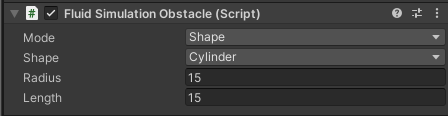

#### Settings

| Property | Description |
| :--- | :--- |
| Obstacle Mode | Defines the source used to determine the obstacle's height and shape within the fluid simulation grid. |
| Obstacle Shape | Defines the type of procedural shape to use when [Mode](#mode) is set to [Shape](#shape). |
| Mode | The method used to define the obstacle's shape for the heightmap render. Defaults to [Renderer](#renderer). |
| Shape | The type of procedural primitive to use when [Mode](#mode) is [Shape](#shape).<br/><br/>- Sphere<br/> <br/>- Box<br/> <br/>- Cylinder<br/> <br/>- Capsule<br/> <br/>- Ellipsoid<br/> <br/>- CappedCone<br/> <br/>- HexPrism<br/> <br/>- Wedge |
| Center | Local offset from the Transform position. |
| Size | The XYZ dimensions for non-uniform procedural shapes.<br/><br/>- **Box:** The full width, height, and depth.<br/> <br/>- **Ellipsoid:** The diameter of the X, Y, and Z axes.<br/> <br/>- **Wedge:** The bounding dimensions of the wedge base and height. |
| Radius | The primary radius for rounded procedural shapes.<br/><br/> <br/>- **Sphere:** The radius of the sphere.<br/> <br/>- **Cylinder:** The radius of the base.<br/> <br/>- **HexPrism:** The radius of the base.<br/> <br/>- **Capsule:** The radius of the cylinder body and the hemispherical end-caps.<br/> <br/>- **Capped Cone:** The radius of the bottom base. |
| Secondary Radius | An secondary radius used for complex shapes. <br/> <br/>- **Capped Cone:** The radius of the top cap. |
| Height | The total length or height of the procedural shape along its alignment [Direction](#direction). |
| Direction | The local axis that the procedural shape's height or length is aligned with.<br/><br/>- **0:** X-Axis (Horizontal)<br/> <br/>- **1:** Y-Axis (Vertical)<br/> <br/>- **2:** Z-Axis (Forward) |
| Conservative Rasterization | Ensures that even sub-pixel geometry is captured during the heightfield bake.<br/><br/>Standard rasterization only renders a pixel if its center is covered by a triangle. <br/>Conservative Rasterization renders a pixel if any part of it is touched by a triangle.<br/><br/>Enabling this prevents thin obstacles like thin walls from being missed <br/>if they happen to fall between pixel centers, ensuring more reliable collision data.<br/>This may cause the obstacle to appear slightly larger than its actual mesh.<br/><br/>***Warning***: This feature requires hardware-level support. It is not supported on platforms like WebGL, OpenGL ES, <br/>or older mobile devices. The system will automatically fall back to standard <br/>rasterization on unsupported hardware. |
| Smooth Rasterization | Enables multi-sampling to produce smoother edges for procedural shapes.<br/><br/>When disabled, procedural shapes are sampled at a single point per grid cell, which can result in jagged edges or<br/>stair stepping in the heightfield. When enabled, the shader performs a multi-sample average <br/>to create a soft, anti-aliased edge.<br/><br/>***Warning***: Because this averages height values within a local neighborhood, perfectly vertical drops <br/>(like the sides of a box) might be turned into slopes. This can lead to height leakage or cause fluid <br/>to climb the edges of an obstacle instead of colliding with a sharp wall. |

<a name="fluid-simulation-event"></a>
### Fluid Event Trigger
**FluidEventTrigger** is a component that can be used to see if and when a object is in a region with fluid The most dominant/highest fluid will be reported. 

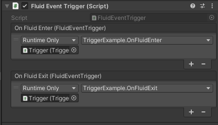

- **onFluidEnter** - the event that will be triggered when fluid enters the trigger.
- **onFluidExit** - the event that will be triggered when fluid has left the trigger.
- **fluidLayer** - the current fluid layer at the location of this trigger.
- **fluidHeight** - the height of the fluid at the location of this trigger.
- **isInFluid** - is the trigger in fluid or not.

Adding the following functions to a script allows the them to be registered to the **OnFluidEnter** and **OnFluidExit** event as shown in the image above.
```c#
public void OnFluidEnter(FluidFrenzy.FluidEventTrigger evt)
{
    Debug.LogFormat("Fluid Layer {0} entered trigger {1} ", evt.name, evt.fluidLayer);
}
public void OnFluidExit(FluidFrenzy.FluidEventTrigger evt)
{
    Debug.LogFormat("Fluid Layer {0} exit trigger {1} ", evt.name, evt.fluidLayer);
}
```

---

<div style="page-break-after: always;"></div>

<a name="fluid-rendering-components"></a>
## 7. Fluid Rendering Components

<a name="fluid-renderer"></a>
### Fluid Renderer

The [Fluid Renderer](#fluid-renderer) component is responsible for rendering the [Fluid Simulation](#fluid-simulation). This component is in charge of creating and rendering the necessary meshes and materials needed for displaying the assigned [Fluid Simulation](#fluid-simulation). Users can customize the [Fluid Renderer](#fluid-renderer) component to create their own rendering effects, similar to [Water Surface](#water-surface) and [Lava Surface](#lava-surface) renderers.

| Property | Description |
| :--- | :--- |
| Debug Mode | Different fluid debugging modes that can be used in the editor. |
| [Surface Properties](#render-properties) | Properties that determine the mesh quality and the specific drawing mode of the fluid surface.<br/><br/>This structure holds settings that control the visual fidelity and performance of the fluid surface mesh. This includes the specific method used to render the mesh, such as standard MeshRenderer, procedural drawing, GPULOD, or a specialized HDRP mode. |
| Fluid Material | The material to be used to render the fluid surface.<br/><br/>This material is internally instantiated at runtime. The component copies the properties from the original material to the new instance, and then overrides or injects any necessary rendering requirements (e.g., shader keywords or properties) for the fluid simulation effects to function correctly. |
| [Simulation](#fluid-simulation) | The [Fluid Simulation](#fluid-simulation) component that this renderer will draw.<br/><br/>This is a mandatory dependency. The FluidRenderer will automatically adopt the world-space dimensions and position of the assigned Fluid Simulation, ensuring the rendered fluid surface matches the simulated area exactly. |
| [Flow Mapping](#fluid-flow-mapping) | The [Fluid Flow Mapping](#fluid-flow-mapping) component that this [Fluid Renderer](#fluid-renderer) uses to visualize fluid currents and wakes.<br/><br/>This component provides the necessary data to the fluid shader, which can be either a dedicated flow map texture (for dynamic UV-offsetting) or material parameters derived directly from the simulation's velocity texture. This allows the fluid surface to depict accurate movement and flow. |

<a name="i-surface-renderer"></a>
### Surface Renderer

[Surface Renderer](#i-surface-renderer) defines a interface for rendering techniques aimed at height field surfaces. Implementing classes should provide specific algorithms and methods to visualize height maps and related surface data in different graphical contexts, such as terrain or fluid fields. This interface is designed to promote extensibility, allowing developers to introduce new rendering methods as needed while adhering to a standard approach for rendering surfaces. Currently there are three classes that extend this interface.  
-  **`MeshRenderer`**  The implementation using standard [Mesh Renderer Surface](https://docs.unity3d.com/ScriptReference/MeshRenderer.html) components.  
-  **`Mesh`**  A simpler implementation using **Mesh Surface**.  
-  **`GPULOD`**  An implementation using a GPU-accelerated LOD system: **GPULOD Surface**.

All classes implementing this interface must provide functionality to clean up resources by overriding the dipose method, ensuring that any graphics resources are properly disposed of.

<a name="render-properties"></a>
### Render Properties

Properties to be used to configure components that use [Surface Renderer](#i-surface-renderer). These properties determine the mesh quality and rendering mode of the surface.

| Property | Description |
| :--- | :--- |
| Render Mode | The method used for generating and rendering the fluid surface geometry.<br/><br/>-  **`MeshRenderer`**  Uses standard GameObjects with [Mesh Renderer](https://docs.unity3d.com/ScriptReference/MeshRenderer.html) components. Best for simple setups where standard object culling is sufficient.  <br/>-  **`DrawMesh`**  Uses [Render Mesh](#render-mesh) to avoid GameObject overhead. Supports GPU Instancing.  <br/>-  **`GPULOD`**  Draws the surface using a GPU-accelerated LOD system. Best for large-scale oceans or lakes.  <br/>-  **`HDRPWaterSurface`**  Bridges the simulation data to a Unity [HDRP Water Surface](#hdrp-water-surface) component (Requires HDRP). |
| Dimension | The total world-space size (X and Z) of the rendered surface. |
| Mesh Resolution | The vertex resolution of the surface's base grid mesh.<br/><br/>For the most accurate visualization, it is recommended to match this value to the source heightmap resolution. |
| Mesh Blocks | The number of subdivisions (blocks) to split the rendering mesh into along the X and Z axes.<br/><br/>Subdividing the mesh improves GPU performance by allowing the camera to cull blocks that are outside the view frustum. |
| Lod Resolution | The vertex resolution of individual LOD patches when using **GPULOD**. |
| Traverse Iterations | The number of iterations the Quadtree traversal algorithm performs per frame when using **GPULOD**.<br/><br/>Higher values resolve the surface quality faster during camera movement but may reduce performance. |
| Lod Min Max | The range of allowable LOD levels, where X is the minimum level and Y is the maximum level. |
| [Hdrp Water Surface](#hdrp-water-surface-properties) | Configuration settings for bridging this simulation's data to an external [HDRP Water Surface](#hdrp-water-surface). |

<a name="hdrp-water-surface-properties"></a>
### HDRP Water Surface Properties

Contains settings used to bridge the fluid simulation data to the Unity HDRP Water System.

| Property | Description |
| :--- | :--- |
| Target Water Surface | The target HDRP Water System component the simulation is to be applied. (Requires HDRP package). |
| Amplitude | Controls the maximum amplitude of the Fluid Simulation used to encode/decode the height to/from 0-1 range |
| Large Current | Controls the weight that the Fluid Simulation's velocity should be applied to the Large Current waves of the HDRP Water System. |
| Ripples | Controls the weight that the Fluid Simulation's velocity should be applied to the Rupples of the HDRP Water System. |

___

<a name="water-rendering"></a>
### Water Rendering

<a name="water-surface"></a>
#### Water Surface

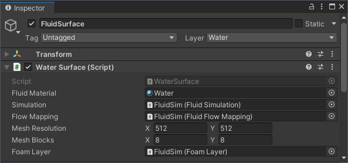

The [Water Surface](#water-surface) is an extension of the [Fluid Renderer](#fluid-renderer) component that renders all things water like [Foam Layer](#foam-layer), [Underwater Effect](#underwater-effect) visuals, absorption, and scattering.
It does this by assigning the active rendering layers to its surface material and using the underwater settings.

| Property | Description |
| :--- | :--- |
| [Foam Layer](#foam-layer) | A FoamLayer component that provides the dynamically generated foam mask texture for water rendering effects.<br/><br/>The component's primary role is to update and supply the dynamic foam mask texture, ensuring foam is applied<br/>accurately to the water material. It also handles necessary adjustments to the mask's texture coordinates (UVs)<br/>to maintain alignment across different rendering setups. |
| Under Water Enabled | Controls whether the [Underwater Effect](#underwater-effect) is currently enabled. |
| [Under Water Settings](#underwater-settings) | Settings for all configurable visual parameters of the [Underwater Effect](#underwater-effect).<br/>This class defines how light interacts with the water volume, including absorption rates, scattering colors, and the appearance of the surface meniscus. |
| Caustics Enabled | Controls whether the [Caustics Effect](#caustics-effect) is currently enabled. |
| [Caustics Settings](#caustics-settings) | Settings for the [Caustics Effect](#caustics-effect), which renders animated light patterns projected onto the scene geometry underwater. |
| Reflections Enabled | Controls whether real-time planar reflections are generated for this water surface. |
| [Reflection Settings](#settings) | Settings for the [Surface Reflections](#surface-reflections) module (Planar Reflections). |

<div style="page-break-after: always;"></div>

<a name="water-shader"></a>
#### Water Shader

The `FluidFrenzy/Water` shader is applied to the material used by the Water Surface component. It provides a comprehensive set of material properties for creating visually appealing water.

**Compatibility:**
This shader is compatible with both the Universal Render Pipeline (URP) and the Built-in Render Pipeline (BiRP).

Note: The High Definition Render Pipeline (HDRP) requires a separate, dedicated shader: *FluidFrenzy/HDRP/Water*.

##### Lighting

Properties controlling the illumination and shading effects.

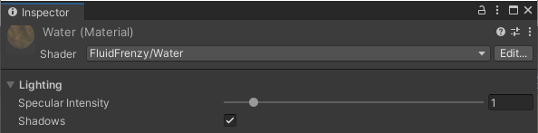

| Property | Description |
| :--- | :--- |
| Specular Intensity | Scales the brightness of specular highlights from the main directional light. |
| Shadows | Enables or disables whether the water surface receives shadows. |

##### Reflection

Properties controlling the water surface's reflection of the environment.

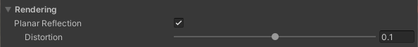

| Property | Description |
| :--- | :--- |
| Planar Reflection | Enables or disables the use of planar reflections instead of only reflection probes. |
| Reflectivity Offset | Offsets the base reflectiveness of the water surface.<br/>Use this to ensure the water is reflective even at sharp viewing angles. |
| Distortion | Scales the distortion applied to planar reflections. |

##### Absorption

Properties controlling depth-based color, transparency, and refraction effects.

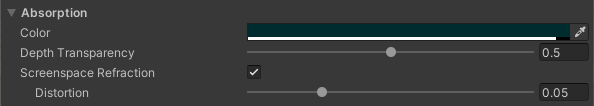

| Property | Description |
| :--- | :--- |
| Color | RGB sets the color of the water at maximum depth. Alpha (A) is the base transparency of the water.<br/>If 'Refraction Mode' is 'Screenspace Absorb', RGB is a color multiplier where White (1.0) is fully transparent.<br/>For 'Alpha' or 'Screenspace Tint', RGB is the final color tint the water reaches at maximum depth/opacity. |
| Depth Transparency | Scales the rate at which the water's color changes and transparency fades based on depth. Lower values make the water more transparent across its depth. |
| Refraction Mode | Selects the method for rendering water transparency and refraction:<br/><br/>• Alpha: Simple alpha blending transparency.<br/>• Opaque: Water is rendered as a solid, non-transparent surface.<br/>• Screenspace Tint: Uses screen-space refraction (GrabPass). Color interpolates from clear to the set color based on depth. Use for a single water color tint.<br/>• Screenspace Absorb: Uses screen-space refraction (GrabPass). Scene color is multiplied by water color, allowing for a color gradient (e.g., clear to turquoise to blue). |
| Distortion | Scales the amount of distortion applied to the screenspace refraction effect ('Screenspace Tint' or 'Screenspace Absorb' modes). |

##### Subsurface Scattering

Properties controlling the diffusion of light and subsurface scattering effect beneath the water surface.

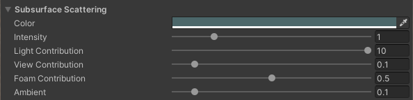

| Property | Description |
| :--- | :--- |
| Color | The color the water will transition to when subsurface scattering occurs. |
| Intensity | Scales the base intensity of the subsurface scattering effect. |
| Ambient | Scales the base contribution, ensuring some subsurface scattering is visible regardless of other parameters. |
| Light Contribution | Scales the contribution of subsurface scattering when the water surface faces away from the main light. |
| View Contribution | Scales the contribution of subsurface scattering when the water surface faces toward the observer/camera. |
| Foam Contribution | Scales the subsurface scattering contribution in areas covered by foam. |

##### Waves

Properties for adding detail to the water surface using normal mapping and procedural vertex displacement.

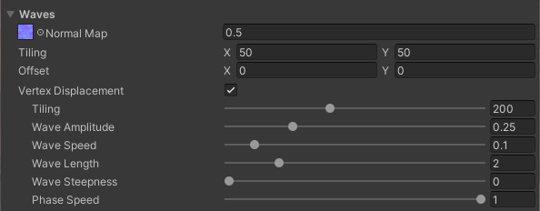

| Property | Description |
| :--- | :--- |
| Normal Map | Texture used to add fine detail to the water's normals for lighting and PBR shading. |
| Vertex Displacement | Enables small-scale, procedural vertex displacement for finer wave details, which is based on the fluid simulation's velocity field. |
| Tiling | Scales the overall density/tiling of the procedural displacement waves. |
| Wave Amplitude | Scales the maximum height (amplitude) of the displacement waves. |
| Phase Speed | Scales the phase speed, which controls how fast the waves move up and down. |
| Wave Speed | Scales the horizontal movement speed of the displacement waves. |
| Wave Length | Scales the distance between the crests (wavelength) of the displacement waves. |
| Wave Steepness | Scales the sharpness or smoothness (steepness) of the displacement waves. |

##### Foam

Properties controlling the appearance and masking of the foam effect.


| Property | Description |
| :--- | :--- |
| Foam Color | Sets the Foam Color (RGB) and acts as a multiplier/mask (A) for the Foam Map's transparency. |
| Foam Map | Texture used for the foam's diffuse color (RGB) and its base mask/transparency (A). |
| Foam Normal Map | Normal map texture used to add PBR lighting detail to the foam. |
| Foam Visibility Range | Sets the minimum and maximum threshold values for when the foam becomes visible and reaches its maximum strength. Foam visibility is interpolated between these values using a smoothstep function. |
| Screenspace Particles | Enables the use of the screenspace particles (from the FluidParticles component) as an additional mask to generate foam. |
| Foam Mode | Selects the blending method for the foam:<br/><br/>• Albedo: Soft foam using the Foam Map for color and mask.<br/>• Clip: Hard-edged foam using the Foam Map's red channel as a clip value for sharp borders.<br/>• Mask: Uses the Foam Layer Mask's value to select one of the Foam Map's RGB channels as an extra mask for blending the foam color, allowing for varied intensity: 0-0.334 uses Blue, 0.334-0.667 uses Green, and 0.667-1 uses Red. |

##### Rendering

General rendering, depth-handling, and simulation sampling properties.


| Property | Description |
| :--- | :--- |
| Layer | Selects which layer (e.g., Water or Lava, etc.) from the Fluid Simulation field to sample for effects. |
| Fade Height | The world height at which the water will be fully faded out.<br/>Used to soften edges or blend with geometry above a certain height. |
| Linear Clip Offset | A linear offset applied to the clip-space Z depth<br/>to help prevent visual clipping (Z-fighting) with close terrain or surfaces. |
| Exponential Clip Offset | An exponential/depth-based offset applied to the clip-space Z depth<br/>to help prevent visual clipping (Z-fighting) with distant terrain or surfaces. |


<a name="underwater-effect"></a>
#### Underwater Effect

The [Underwater Effect](#underwater-effect) module renders the visuals you see when the camera goes underwater. It is supported in all render pipelines.

It uses the same simulation math as the water surface to ensure the underwater volume matches the waves perfectly. 
However it has its own independent visual settings, allowing you to style the underwater atmosphere separately from the surface itself.

This distinction is useful for gameplay as you can make the underwater view clearer or brighter than the surface to help players see further. 
The effect handles features like light absorption, fog scattering, and directional lighting to create the underwater atmosphere.

<video controls autoplay loop muted style="max-width: 100%; height: auto;">
  <source src="images/underwater_intro.webm" type="video/webm">
  Your browser does not support the video tag.
</video>

<a name="underwater-settings"></a>
#### Underwater Settings

Settings for all configurable visual parameters of the [Underwater Effect](#underwater-effect).
This class defines how light interacts with the water volume, including absorption rates, scattering colors, and the appearance of the surface meniscus.

#####  Absorption

<video controls autoplay loop muted style="max-width: 100%; height: auto;">
  <source src="images/underwater_absorption.webm" type="video/webm">
  Your browser does not support the video tag.
</video>

| Property | Description |
| :--- | :--- |
| Water Color | The base transmission color of the water.<br/><br/>This defines the color of the water as light passes through it. Brighter colors make the water look clear while darker colors make the water look thick and deep. This works with the alpha value and the absorption depth scale to decide how much the scene behind the water is tinted. |
| Depth Transparency | Controls the rate at which light is absorbed as it travels through the water.<br/><br/>Higher values result in darker water where light cannot penetrate as deeply. This scaling factor applies to the exponential decay of the **Water Color**. |
| Depth Limits | Clamps the calculated absorption to a specific range (Min, Max).<br/><br/>Useful for preventing the water from becoming completely black at extreme depths or ensuring a minimum amount of visibility. |

#####  Meniscus(Water Line)

<video controls autoplay loop muted style="max-width: 100%; height: auto;">
  <source src="images/underwater_meniscus.webm" type="video/webm">
  Your browser does not support the video tag.
</video>

| Property | Description |
| :--- | :--- |
| Thickness | The vertical thickness of the meniscus line (the water-air boundary) on the camera lens. |
| Blur | The amount of blur applied to the meniscus line to soften the transition between underwater and above-water. |
| Darkness | Controls the intensity/darkness of the meniscus line effect. |

#####  Scattering (Fog)

<video controls autoplay loop muted style="max-width: 100%; height: auto;">
  <source src="images/underwater_scattering.webm" type="video/webm">
  Your browser does not support the video tag.
</video>

| Property | Description |
| :--- | :--- |
| Scatter Color | The color of the light scattered within the water volume (subsurface scattering/fog color). |
| Scatter Ambient | The base ambient contribution to the scattering effect, independent of direct lighting. |
| Light Intensity | Scales the influence of the main directional light on the scattering effect. |
| Total Intensity | A global multiplier for the overall scattering intensity. |

<a name="caustics-effect"></a>
#### Caustics Effect

**Caustics** is an option on the [Water Surface](#water-surface) that simulates the shifting light patterns projected onto the seafloor and submerged objects.


To keep performance high, the system uses a fast approximation rather than trying to calculate physically accurate light paths. It combines an animated texture sequence with procedural highlights that are tied to the surface wave curvature, ensuring the light patterns always match the motion of the water above.

The effect works directly with the [Fluid Simulation](#fluid-simulation), meaning it uses the same flow mapping as the surface itself. If the water is flowing or swirling, the caustics will follow that same movement. You can also enable triplanar projection to prevent the patterns from stretching or smearing on vertical surfaces like underwater cliffs or steep walls.

It also accounts for surface conditions for example, **Foam Masking** can be used to soften or dim the light patterns in areas where thick foam would naturally scatter the light. To keep transitions smooth, the effect uses depth fading to blend the patterns in and out based on how far they are from the surface, preventing them from looking too sharp at the shoreline or in very deep water.

<a name="caustics-settings"></a>
#### Caustics Settings

Settings for all configurable visual parameters of the [Caustics Effect](#caustics-effect).
This class defines animated light patterns projected underwater, wave-driven highlights, and global visibility attenuation.

##### Texture Projection
You can use these settings to customize the look of the animated texture patterns, including how fast they move, how they warp with the waves, and whether they use triplanar mapping to stay consistent on vertical walls.

<video controls autoplay loop muted style="max-width: 100%; height: auto;">
  <source src="images/caustics_texture_projection.webm" type="video/webm">
  Your browser does not support the video tag.
</video>

| Property | Description |
| :--- | :--- |
| Animation FPS | The playback speed of the animated caustics texture sequence.<br/><br/>Defines how many frames per second the texture advances. Higher values result in faster, smoother motion. |
| Tiling | Controls the scale of the projected caustics pattern.<br/><br/>Higher values increase the tiling frequency, making the pattern appear smaller and more dense across the environment. |
| Triplanar Projection | Enables triplanar projection to prevent texture stretching on vertical surfaces.<br/><br/>Projects the texture from three orthogonal axes (X, Y, Z) instead of a single top-down projection. <br/>Essential for maintaining pattern consistency on cliffs, walls, and steep underwater terrain. |
| Wave UV Distortion | The strength of the UV distortion applied to the caustics based on surface wave normals.<br/><br/>Simulates refractive warping by shifting the texture coordinates relative to the waves above. |
| Texture Intensity | The brightness multiplier for the projected caustics texture.<br/><br/>An independent scalar specifically for the animated texture component of the effect. |
| Channel Mask | Defines which texture color channels contribute to the final caustics pattern.<br/><br/>Useful for isolating specific channels in packed textures. |
| Chromatic Aberration | The strength of the color splitting effect at the edges of the caustics.<br/><br/>Simulates light dispersion (prismatic effect), creating rainbow-like fringing around high-contrast areas of the pattern. |

##### Wave Highlights
These properties control procedural glints calculated directly from the surface waves, allowing you to adjust the intensity and sharpness of the light streaks hitting the seafloor.

<video controls autoplay loop muted style="max-width: 100%; height: auto;">
  <source src="images/caustics_wave_highlights.webm" type="video/webm">
  Your browser does not support the video tag.
</video>

| Property | Description |
| :--- | :--- |
| Wave Intensity | The brightness of the procedural glints generated by surface wave curvature.<br/><br/>Unlike the texture projection, these highlights are calculated analytically from wave refraction to provide a direct link between the surface and the seafloor. |
| Wave Sharpness | Controls the focus and size of the procedural wave highlights.<br/><br/>Higher values result in sharper, thinner glints (lensing effect), while lower values create broader, softer highlights. |

##### Global Settings
This section handles the overall strength and blending of the effect, including how it reacts to shadows and foam, and how it fades out as the water depth increases.

<video controls autoplay loop muted style="max-width: 100%; height: auto;">
  <source src="images/caustics_global.webm" type="video/webm">
  Your browser does not support the video tag.
</video>

| Property | Description |
| :--- | :--- |
| Global Intensity | A multiplier for all caustic lighting contributions.<br/><br/>Scales both the texture projection and the procedural wave highlights simultaneously. |
| Darkness | Controls how much the sea floor is darkened in the areas between light patterns.<br/><br/>Increasing this value darkens the *caustic shadows*, making the bright light patterns appear more high-contrast and prominent. |
| Shadow Intensity | Controls the visibility of caustics within areas shadowed by external light sources.<br/><br/>A value of 0 makes caustics completely invisible in shadow, while a value of 1 allows them to remain fully visible. |
| Surface Fade-In | Defines the depth range near the surface where the caustics begin to appear.<br/><br/>The X value represents the depth where the effect starts, and the Y value is where it reaches full intensity. This prevents visual "popping" at the water line. |
| Depth Fade-Out | Defines the depth range where the caustics gradually disappear as light is absorbed.<br/><br/>The X value is the depth where fading begins, and the Y value is the depth where caustics are completely extinguished. |
| Foam Masking | Controls how much surface foam occludes the caustics on the seafloor.<br/><br/>Simulates the diffusive nature of bubbles. Thick foam scatters light, preventing sharp caustics from forming and casting a soft shadow on the environment below. |


<a name="surface-reflections"></a>
#### Surface Reflections

**Surface Reflections** are a set of settings on the [Water Surface](#water-surface) component that generate **real-time reflections** to enhance the rendering quality of the water.

This is achieved by rendering the scene again from a mirrored perspective flipped around the water plane and capturing the result to a texture. This reflection texture is then applied to the water material.  

The component reads the height of the fluid simulation to set the reflection plane as accurately as possible. It includes built-in smoothing (controlled by [Smooth Position](#m_smooth-position)) to prevent quick, jittering changes caused by small, rapid waves on the fluid surface.  

**Note:** To see the results of the reflection, the water material (e.g., `FluidRenderer.fluidMaterial`) must have surface reflections enabled in its shader.

**Note:** HDRP does not use Surface Reflections in the water shader, it uses the reflections directly rendered by the pipeline.


The following settings can be configured to setup the Planar reflections:

| Property | Description |
| :--- | :--- |
| Resolution | The quality/resolution of the generated planar reflection texture. |
| Culling Mask | Which layers the planar reflection camera renders. |
| Clear Flags | What to display in empty areas of the planar reflection's view (e.g., Skybox, Solid Color). |
| Clip Plane | A vertical offset to apply to the reflection plane. This can be used to prevent clipping artifacts with the water surface. |
| Smooth Position | Smoothes the reflection plane's height and position over multiple frames to prevent jittering caused by rapid fluid simulation updates. |
| Renderer ID | SRP Renderer to use for the planar reflection pass. Use this to select a cheaper render pass for the reflection camera. |
| Shadow Quality | Controls shadow rendering in the reflection (BiRP Only). |


___
<div style="page-break-after: always;"></div>

<a name="lava"></a>
### Lava

<a name="lava-surface"></a>
#### Lava Surface
[Lava Surface](#lava-surface) is an extension of the [Fluid Renderer](#fluid-renderer) component that specifically deals with rendering lava-related elements of the fluid simulation.

This component adds specific lava rendering features, such as heat and emissive color gradients, by generating and applying a custom **Heat Look-Up Texture (LUT)**.  

 The LUT is procedurally generated from the **Heat** gradient field and is assigned to the [Fluid Material](#fluid-material). This allows the lava's emissive color and heat visual effect to be determined dynamically by factors like the lava's velocity or age.


| Property | Description |
| :--- | :--- |
| Generate Heat Lut | If enabled, the **Heat** gradient will be used to procedurally generate a **Heat LUT** that overrides the existing LUT on the [Fluid Material](#fluid-material). |
| Heat | The [Gradient](#gradient) used to define the heat/color transition for the lava. The color samples are mapped from Cold Lava (Left side of the gradient) to Hot Lava (Right side of the gradient). |


<a name="lava-shader"></a>
#### Lava Shader

The *FluidFrenzy/Lava* shader is applied to the material used by the Lava Surface component. It creates realistic, flowing lava visuals where the 'heat' and resulting glow are dynamically driven by the **length of the fluid's velocity vector** in the simulation.

The shader uses textures for the base 'cold' lava surface (Albedo, Smoothness, Normal Map) and employs a specialized **Heat Look-Up Table (LUT)** alongside an **Emission Map** to control the vibrant colors and intensity of the glowing, 'hot' lava. A separate **Noise** texture is used to break up tiling patterns.

**Compatibility:**
The *FluidFrenzy/Lava* shader is for URP and BiRP. The High Definition Render Pipeline (HDRP) requires a separate, dedicated shader: *FluidFrenzy/HDRP/Lava*.


##### Lighting

Properties controlling the illumination and shading effects.

| Property | Description |
| :--- | :--- |
| Light Intensity | Scales the influence of the main directional light on the lava surface (e.g., specular highlights). |
| Shadows | Enables or disables if the lava surface receives shadows from other scene objects. |

##### Heat & Emission

Properties controlling the lava's color and emission, driven by the fluid's 'heat' (usually fluid velocity/movement).

| Property | Description |
| :--- | :--- |
| Heat LUT | Gradient Lookup Texture (LUT) used to determine the lava's color and emission based on the fluid's 'heat'. |
| Heat Scale | Scales the fluid 'heat' value when sampling the Heat LUT gradient. Lower values increase the effective range of the lookup. |
| Emission Map | Texture used for the emission color of the lava. A sample of this texture is multiplied by the fluid's 'heat'. |
| Emission | Scales the overall intensity of the emission determined by the Heat LUT and the Emission Map. |

##### Material Properties

Properties controlling the cold lava surface's visual and PBR shading characteristics.

| Property | Description |
| :--- | :--- |
| Albedo | Sets the base Albedo color and texture of the lava. This represents the appearance of cold (non-emissive) lava. |
| Smoothness Scale | Scales the PBR smoothness of the cold lava surface, affecting its specular reflections. |
| Normal Map | Normal map texture used to add detailed lighting to the cold lava surface. |
| Noise | Noise texture used to eliminate noticeable tiling and repetition from the lava textures. |

##### Rendering

General rendering, depth-handling, and simulation sampling properties.

| Property | Description |
| :--- | :--- |
| Layer | Selects which layer (e.g., Water or Lava, etc.) from the Fluid Simulation field to sample for effects. |
| Fade Height | The world height at which the lava will be fully faded out.<br/>Used to soften edges or blend with geometry above a certain height. |
| Linear Clip Offset | A linear offset applied to the clip-space Z depth<br/>to help prevent visual clipping (Z-fighting) with close terrain or surfaces. |
| Exponential Clip Offset | An exponential/depth-based offset applied to the clip-space Z depth<br/>to help prevent visual clipping (Z-fighting) with distant terrain or surfaces. |

___

<a name="particle-shaders"></a>
### Particles Shaders
Fluid Frenzy uses custom shaders to render its completely GPU-accelerated particle system. Two shaders are available: *ProceduralParticle* (Lit) and *ProceduralParticleUnlit*. Both render particles as billboards.

- ProceduralParticle (Lit): Includes PBR lighting with support for Normal Maps, Metallic, and Smoothness.
- ProceduralParticleUnlit (Unlit): Does not perform lighting, offering a lower rendering cost.

Both shaders share settings for **Blend Mode** and **Billboard Mode**. **Billboard Mode** controls particle orientation, including options for camera-facing or world-up normals to manage lighting.

**Compatibility**:
For URP and BiRP, the shaders are *FluidFrenzy/ProceduralParticle* and *FluidFrenzy/ProceduralParticleUnlit*.
The High Definition Render Pipeline (HDRP) requires its own dedicated shaders: *FluidFrenzy/HDRP/ProceduralParticle* and *FluidFrenzy/HDRP/ProceduralParticleUnlit*.


##### Properties

| Property | Description |
| :--- | :--- |
| Albedo | albedo color and transparency of the particle. |
| Color | albedo color and transparency of the particle. |
| Normal Map | can be used to add extra lighting details. |
| Alpha Threshold | Alpha below this value will be clipped. |
| Blend Mode | select which to use for the particles. |
| Source Blend | Source Blend. |
| Dest Blend | Dest Blend. |
| ZWrite | Write particle to the depth buffer. |
| Billboard Mode | Select which method to use for rendering the particle billboard.<br/><br/>• Camera: the billboard and world normal will face in the direction of the camera.<br/><br/>• Camera Normal Up: the billboard will face the camera and the normal will face in in the world space up direction.This can be useful to have more uniform lighting from every direction.<br/><br/>• Up: the billboard and normal will both face in the world space up direction.<br/><br/>• Normal: not yet implemented. |
| Metallic | The metalness of this material. |
| Smoothness | The smoothness of this material. |
| Lighting |  |
| Rendering |  |

<a name="shadow-grabber"></a>
### Shadows
Both the Water and Lava is rendered after any opaque layers to allow for refraction and to prevent sorting issues. This means that in the Built-in Render pipeline shadows are not automatically sampled due to the transparent nature of the rendering. In order to solve this the user can add he **ShadowGrabber** component to the **Main Directional Light** in the scene. This will assign the shadow buffer to global shader property so that the Water and Lava shader can read it. In order for a material to read it the Shadows property on the Material needs to be set to either *Hard* or *Soft*.

<a name="hdrp-water-system"></a>
<a name="hdrp-water-surface"></a>
### HDRP Water System
Fluid Frenzy has the ability to apply the Fluid Simulation's data to the [HDRP Water System](https://docs.unity3d.com/Packages/com.unity.render-pipelines.high-definition@14.0/manual/WaterSystem-use.html). This allows the user to enhance their HDRP scene without sacrificing the quality HDRP provides.

To support this the user will have to enable decal support in their HDRP Quality settings:


The displacement and flowmapping of the Fluid Simulation is applied using the [Water Decal](https://docs.unity3d.com/Packages/com.unity.render-pipelines.high-definition@17.1/manual/water-deform-a-water-surface.html) system, which is automatically created when setting the [Water Surface](#water-surface) to the **HDRP Water System** mode.
The Water Decal system uses signed normalized render buffers to apply the displacement, which requires a amplitude to be applied to the decal. This amplitude is the maximum height the simulation will be able to displace the water surface.


| Property | Description |
| :--- | :--- |
| Target Water Surface | The target HDRP Water System component the simulation is to be applied. (Requires HDRP package). |
| Amplitude | Controls the maximum amplitude of the Fluid Simulation used to encode/decode the height to/from 0-1 range |
| Large Current | Controls the weight that the Fluid Simulation's velocity should be applied to the Large Current waves of the HDRP Water System. |
| Ripples | Controls the weight that the Fluid Simulation's velocity should be applied to the Rupples of the HDRP Water System. |

___

<a name="terrain"></a>
## 8. Terrain

Fluid Frenzy has the capability to render terrain height maps using a custom terrain system. 
Currently features for terrains are limited but consists of the following:

1. LOD
2. Splatmapping
3. Terraforming
4. Collision

<a name="simple-terrain"></a>
#### Simple Terrain

A specialized terrain rendering component designed for the [Fluid Simulation](#fluid-simulation) system, capable of supporting real-time modifications from an [Erosion Layer](#erosion-layer).

Unlike a Unity Terrain, `SimpleTerrain` allows for dynamic updates to its heightmap data directly on the GPU. When an [Erosion Layer](#erosion-layer) is active, sediment transport and deposition changes are applied to this terrain instantly.


##### **Terrain Settings**

| Property | Description |
| :--- | :--- |
| Terrain Material | The material used to render the terrain surface.<br/><br/>The assigned shader must support vertex displacement based on the **Render Heightmap** to correctly visualize the terrain shape. |
| [Surface Properties](#render-properties) | Configuration settings that determine the visual quality, resolution, and rendering method (e.g., MeshRenderer vs. GPULOD) of the terrain. |
| Source Heightmap | The input texture that defines the initial shape and composition of the terrain.<br/><br/>For best results, use a 16-bit (16bpp) texture to prevent stepping artifacts. <br/><br/> The texture channels represent distinct material layers stacked sequentially from bottom to top. All layers are erodible.  <br/>-  **`Red Channel`**  Layer 1 (Bottom). Defines the base height. In `TerraformTerrain`, a separate splatmap texture is used to apply visual variation to this specific layer.  <br/>-  **`Green Channel`**  Layer 2. Stacked on top of the Red channel.  <br/>-  **`Blue Channel`**  Layer 3. Stacked on top of the Green channel.  <br/>-  **`Alpha Channel`**  Layer 4 (Top). Stacked on top of the Blue channel. |
| Height Scale | A global multiplier applied to the height values sampled from the [Source Heightmap](#source-heightmap).<br/><br/>This converts the normalized (0 to 1) texture data into world-space height units. |
| Upsample | Toggles bilinear interpolation for the heightmap sampling.<br/><br/>Enabling this increases the number of samples taken to smooth out the terrain. This is particularly useful for reducing "stair-stepping" artifacts when using lower bit-depth source textures. |
| Shadow Light | The primary directional light used to calculate shadows on the terrain.<br/><br/>This is primarily used when rendering in the Built-in Render Pipeline (BiRP) to manually handle shadow projection on the custom terrain mesh. |
| [Collider Properties](#collider-properties) | Configuration settings for generating the physical [Terrain Collider](https://docs.unity3d.com/ScriptReference/TerrainCollider.html) associated with this terrain. |

##### **Mesh Rendering**
| Property | Description |
| :--- | :--- |
| Render Mode | The method used for generating and rendering the fluid surface geometry.<br/><br/>-  **`MeshRenderer`**  Uses standard GameObjects with [Mesh Renderer](https://docs.unity3d.com/ScriptReference/MeshRenderer.html) components. Best for simple setups where standard object culling is sufficient.  <br/>-  **`DrawMesh`**  Uses [Render Mesh](#render-mesh) to avoid GameObject overhead. Supports GPU Instancing.  <br/>-  **`GPULOD`**  Draws the surface using a GPU-accelerated LOD system. Best for large-scale oceans or lakes.  <br/>-  **`HDRPWaterSurface`**  Bridges the simulation data to a Unity [HDRP Water Surface](#hdrp-water-surface) component (Requires HDRP). |
| Dimension | The total world-space size (X and Z) of the rendered surface. |
| Mesh Resolution | The vertex resolution of the surface's base grid mesh.<br/><br/>For the most accurate visualization, it is recommended to match this value to the source heightmap resolution. |
| Mesh Blocks | The number of subdivisions (blocks) to split the rendering mesh into along the X and Z axes.<br/><br/>Subdividing the mesh improves GPU performance by allowing the camera to cull blocks that are outside the view frustum. |
| Lod Resolution | The vertex resolution of individual LOD patches when using **GPULOD**. |
| Traverse Iterations | The number of iterations the Quadtree traversal algorithm performs per frame when using **GPULOD**.<br/><br/>Higher values resolve the surface quality faster during camera movement but may reduce performance. |
| Lod Min Max | The range of allowable LOD levels, where X is the minimum level and Y is the maximum level. |

##### **Collision**

| Property | Description |
| :--- | :--- |
| Create Collider | Toggles the generation of a [Terrain Collider](https://docs.unity3d.com/ScriptReference/TerrainCollider.html) to handle physical interactions with the fluid surface. |
| Resolution | Specifies the grid resolution of the generated [Terrain Collider](https://docs.unity3d.com/ScriptReference/TerrainCollider.html).<br/><br/>This value determines the density of the physics mesh. Higher resolutions result in more accurate physical interactions but increase generation time and physics processing overhead. <br/><br/> Internally, the actual grid size is set to `resolution + 1` to satisfy heightmap requirements. |
| Realtime | Controls whether the collider's heightmap is updated at runtime to match the visual fluid simulation.<br/><br/>When enabled, the simulation data is continuously synchronized with the physics collider. Note that this process requires reading GPU terrain data back to the CPU and applying it to the **Terrain Data**, which can be resource-intensive and cause garbage collection spikes. |
| Update Frequency | The interval, in frames, between consecutive collider updates when [Realtime](#realtime) is enabled.<br/><br/>Increasing this value reduces the performance cost of the readback but causes the physics representation to lag behind the visual rendering. |
| Timeslicing | The number of frames over which a single full collider update is distributed.<br/><br/>This feature splits the heightmap update into smaller segments, processing only a fraction of the data per frame. This helps to smooth out performance spikes and maintain a stable framerate, though it increases the time required for the collider to fully reflect a change in the fluid surface. |

##### **Saving and Loading**
The state of the terrain and fluid simulation can both be saved and loaded back in by using the SaveTerrain and LoadTerrain methods (or equivalent editor functions).

The simulation state is saved as a collection of textures (e.g., height map, velocity, pressure). Each texture can be saved and loaded using one of two formats, managed by the new SimulationIO utility:

    RAW (.data): The recommended, high-fidelity format. This custom format is fast, lossless, and is essential for saving high-precision simulation data (e.g., floating-point textures). It supports optional GZip compression and embedding texture metadata directly within the file.

    PNG (.png): A standard image format. While useful for visual debugging, it is lossy and is not recommended for saving the full, high-precision simulation state.

The functionality is also exposed in the editor for testing purposes.

<a name="terraform-terrain"></a>
#### Terraform Terrain
The **Terraform Terrain** component is an extension of the **Simple Terrain** component. It adds an extra [splat map](https://en.wikipedia.org/wiki/Texture_splatting) that the [Terraform Layer](#terraform-layer) makes modifications to. This splat map is used to represent different terrain layers on the base layer of the terrain. It is rendered by the **FluidFrenzy/TerraformTerrain** or **FluidFrenzy/TerraformTerrain(Single Layer) shader.


| Property | Description |
| :--- | :--- |
| Splatmap | The texture defining the initial material distribution (splatmap) across the terrain surface.<br/><br/>The splat map acts as a mask to determine which of the four material layers from the assigned [Terrain Material](#terrain-material) are rendered at any given coordinate. Each channel of the splat map corresponds to a material layer:  <br/>- Layer 1: Red channel (Primary Material) <br/>- Layer 2: Green channel <br/>- Layer 3: Blue channel <br/>- Layer 4: Alpha channel  **Crucial Constraint:** When using `TerraformTerrain`, this splat map is only applied to the base (Red channel) physical layer data defined by the [Source Heightmap](#source-heightmap). The other physical layers (G, B, A channels of the heightmap) use their respective material properties directly without being masked by this splat map. |

<a name="terraform-terrain-shader"></a>
#### Terraform Terrain Shader

A multi-layered, texture-array-driven surface shader designed to render a terrain that is fully compatible with Fluid Frenzy's terraforming capabilities.

This shader requires **Texture2DArray** assets for its texture slots. These assets can be created using the **Window > Fluid Frenzy Texture Array Creator** tool.

The shader organizes its texture inputs into two primary, fully terraformable groups: Splat Layers and Dynamic Layers.

Splat Layers (R):
Defines the four base layers, blended by a Splatmap (RGBA).

Dynamic Layers:
Three additional layers for dynamic, transformable materials (mud, sand, snow).

Layer Overrides:
Allows per-layer adjustments across all seven layers, including Layer Tint, Tiling / Offset, and Normal Scale, without modifying source textures.

Compatibility:
The FluidFrenzy/TerraformTerrain shader is for URP and BiRP. The High Definition Render Pipeline (HDRP) requires a separate, dedicated shader: FluidFrenzy/HDRP/TerraformTerrain.


##### Splat Layers (R)
This section defines the four base terrain layers. They are blended together using the RGBA channels of the splatmap to create ground variation. These layers are fully terraformable.

| Property | Description |
| :--- | :--- |
| Albedo | Texture2DArray for Albedo (RGB). |
| Mask Map | Texture2DArray for Metallic (R), Occlusion (G), and Smoothness (A). |
| Normal Map | Texture2DArray for Normal Maps. |

##### Dynamic Layers
These three layers are intended for terraformable materials like mud, sand, or snow, which can be transformed into other layers during gameplay. They use a separate set of Texture2DArray assets.

| Property | Description |
| :--- | :--- |
| Albedo | Texture2DArray for Albedo (RGB). |
| Mask Map | Texture2DArray for Metallic (R), Occlusion (G), and Smoothness (A). |
| Normal Map | Texture2DArray for Normal Maps. |

##### Layer Settings
This section provides a grid to override properties for each of the 7 terrain layers (4 Splat Layers and 3 Dynamic Layers). This allows you to adjust the look of each material without creating new textures.

| Property | Description |
| :--- | :--- |
| Layer Tint | A color multiplier for each layer's albedo. |
| Tiling | The UV tiling (XY) for each layer. |
| Offset | The UV offset (ZW) for each layer. |
| Normal Scale | Per-layer scale for each of the Layer normal maps. |

<a name="terraform-terrain-single-shader"></a>
#### Terraform Terrain (Single Layer) Shader
The Terraform Terrain (Single Layer) shader is a cheaper version of the Terraform Terrain shader and handles the rendering of the Terraform Terrain. It has layers with texture slots for rendering the layers of the terrain. The height of these layers 1 to 4 is controlled by the heightmap's red channel. The heightmap and splatmap(RGBA) can be modified manually or by the **Terraform Terrain Layer** due to fluid mixing. Each layer corresponds to a channel in the splatmap as described above. The **Top/Erosion Layer** has a fixed color layer that cannot have its appearance changed as the visibility and height is controlled by the heightmap's green channel.


| Property | Description |
| :--- | :--- |
| Albedo | albedo texture and color(multiplier) of the layer |
| Normal Map | normal map of the layer |
| Mask Map | metallic(R), occlusion(G), smoothness(A) of the layer. |

---

<div style="page-break-after: always;"></div>

<a name="fluid-modifier"></a>
## 9. Fluid Modifiers

[Fluid Modifier](#fluid-modifier) are Components that can be attached to a GameObject. This is the base class other [Fluid Modifier](#fluid-modifier) (can) derive from and can be used to write custom interactions with the [Fluid Simulation](#fluid-simulation) They are used to interact with the simulation in multiple ways, ranging from adding/removing fluids and applying forces. There are several Fluid Modifier types each with specific behaviors.

<a name="fluid-modifier-volume"></a>
### Fluid Modifier Volume

[Fluid Modifier Volume](#fluid-modifier-volume) is a FluidModifier that interacts with any [Fluid Simulation](#fluid-simulation). There are several modes that can be used to interact with fluid simulations by setting the Fluid Modifier Type.


<a name="fluid-source-settings"></a>
#### Fluid Source Settings

Defines the settings when [Source](#source) is enabled on the [Fluid Modifier Volume](#fluid-modifier-volume).

| Property | Description |
| :--- | :--- |
| Mode | Sets the insdasput mode of the modifier, defining the shape or source of the fluid input.<br/><br/>Fluid input modes include:  <br/>-  **[Circle](#circle)**  Fluid input in a circular shape.  <br/>-  **[Box](#box)**  Fluid input in a rectangular shape.  <br/>-  **[Texture](#texture)**  Fluid input defined by a source texture. |
| Dynamic | Enables or disables movement for this modifier.<br/><br/>When disabled, the modifier is treated as static and its contribution is calculated once at the start of the simulation. This improves performance for multiple stationary fluid sources. |
| Blend Mode | Defines the blending operation used to apply the fluid source to the simulation's height field.<br/><br/>This determines how the fluid is applied to the simulation's current height. Options include:<br/> - [Additive](#additive): Adds or subtracts the fluid amount.<br/> - [Set](#set): Sets the height to a specific value.<br/> - [Minimum](#minimum)/[Maximum](#maximum): Clamps the height to the target value. |
| Space | Specifies the coordinate space to which the fluid height source should be set relative to.<br/><br/>-  **[World Height](#world-height)**  The height is interpreted as a specific world Y-coordinate.  <br/>-  **[Local Height](#local-height)**  The height is interpreted relative to the fluid surface's base height. |
| Strength | Adjusts the amount of fluid added or set by the volume.<br/><br/>-  **For Additive blending**  This is the rate per second of fluid to add/subtract.  <br/>-  **For Set blending**  This value contributes to the target height. |
| Falloff | Adjusts the curve of the distance-based strength, controlling how quickly the influence falls off from the center.<br/><br/>Higher values create a faster falloff, resulting in a more focused fluid source. |
| Target Layer | Specifies the target fluid layer to which the fluid will be added. |
| Size | Adjust the size (width and height) of the modification area in world units. |
| Source Texture | The source texture used to determine the shape and intensity of the fluid input when [Mode](#mode) is [Texture](#texture). Only the red channel of the texture is used. |

<a name="fluid-flow-settings"></a>
#### Fluid Flow Settings

Defines the settings when [Flow](#flow) is enabled on the [Fluid Modifier Volume](#fluid-modifier-volume).

| Property | Description |
| :--- | :--- |
| Mode | Sets the input mode of the modifier, defining how flow is applied.<br/><br/>Flow application modes include:  <br/>-  **[Circle](#circle)**  A constant directional flow within a circular shape.  <br/>-  **[Vortex](#vortex)**  A circular flow with radial and tangential control.  <br/>-  **[Texture](#texture)**  Flow direction supplied from a dedicated flow map texture. |
| Direction | Sets the 2D direction in which the flow force will be applied for [Circle](#circle).<br/><br/>The `x` component maps to world X, and the `y` component maps to world Z (assuming a flat surface). |
| Blend Mode | The blending operation used to apply the generated velocity to the simulation's velocity field.<br/><br/>This determines how the velocity is applied to the simulation's current flow. Options include:  <br/>-  **[Additive](#additive)**  Adds or subtracts the flow/velocity amount.  <br/>-  **[Set](#set)**  Sets the flow/velocity to a specific vector.  <br/>-  **[Minimum](#minimum)/[Maximum](#maximum)**  Clamps the velocity vector components to the target values. |
| Strength | Adjusts the magnitude of the flow applied to the velocity field.<br/><br/>For [Vortex](#vortex) mode, this specifically controls the *inward* flow to the center. |
| Radial Flow Strength | Adjusts the amount of *tangential* flow applied for [Vortex](#vortex) mode. Higher values create a faster spinning vortex. |
| Falloff | Adjusts the curve of the distance-based strength, controlling how quickly the influence falls off from the center.<br/><br/>Higher values create a sharper shape with faster falloff. |
| Size | Adjust the size (width and height) of the modification area in world units. |
| Texture | The flow map texture used as input when [Mode](#mode) is [Texture](#texture).<br/><br/>The texture's Red and Green channels map to the X and Y velocity components. The texture is unpacked from the [0, 1] range to the [-1, 1] velocity range. |

<a name="fluid-force-settings"></a>
#### Fluid Force Settings

Defines the settings when [Force](#force) is enabled on the [Fluid Modifier Volume](#fluid-modifier-volume).

| Property | Description |
| :--- | :--- |
| Mode | Sets the input mode of the modifier, defining the type of force applied.<br/><br/>Force application modes include:  <br/>-  **[Circle](#circle)**  A directional force within a circular shape (for waves/pushes).  <br/>-  **[Vortex](#vortex)**  A downward, distance-based force (for whirlpools).  <br/>-  **[Splash](#splash)**  An immediate outward force (for splash effects).  <br/>-  **[Texture](#texture)**  Forces created from a texture input. |
| Blend Mode | The blending operation used to apply or dampen the force in the simulation.<br/><br/>This determines how the force is applied to the simulation. Options include:  <br/>-  **[Additive](#additive)**  Adds or subtracts the force amount.  <br/>-  **[Set](#set)**  Sets the force to a specific vector.  <br/>-  **[Minimum](#minimum)/[Maximum](#maximum)**  Clamps the force vector components to the target values. |
| Direction | Sets the 2D direction of the applied force/wave propagation.<br/><br/>The `x` component maps to world X, and the `y` component maps to world Z (assuming a flat surface). |
| Strength | Controls the magnitude of the force applied.<br/><br/>This represents the height of the wave/splash, the depth of the vortex, or the strength to apply the supplied texture. |
| Falloff | Adjusts the curve of the distance-based strength, controlling how quickly the influence falls off from the center.<br/><br/>Higher values create a sharper shape with faster falloff. |
| Size | Adjust the size (width and height) of the modification area in world units. |
| Texture | The source texture used as an input when [Mode](#mode) is [Texture](#texture). Only the red channel is used for height/force displacement. |


<a name="fluid-modifier-waves"></a>
### Fluid Modifier Waves

A specialized [Fluid Modifier](#fluid-modifier) that generates procedural wave forces to simulate wind-driven water surfaces.

This component stacks multiple layers of waves (octaves) with varying properties to create complex, non-repetitive surface motion. It generates forces that displace the fluid, creating the visual and physical appearance of waves.


| Property | Description |
| :--- | :--- |
| Strength | A global multiplier applied to the total force calculated from all wave octaves. |
| Wave Count | The number of individual wave layers (octaves) to generate and stack.<br/><br/>Each octave is randomly generated based on the ranges defined below. Increasing this count adds more detail and complexity to the surface but increases the computational cost. |
| Wave Length Range | Defines the minimum and maximum wavelength (physical size) for the generated octaves.<br/><br/>-  **X (Min)**  The smallest allowed wavelength (tight ripples).  <br/>-  **Y (Max)**  The largest allowed wavelength (broad swells). |
| Direction Range | Defines the angular range (in degrees) for the propagation direction of the waves.<br/><br/>-  **X (Min)**  The minimum angle in degrees.  <br/>-  **Y (Max)**  The maximum angle in degrees.   Use this to restrict waves to a specific wind direction or allow them to move chaotically in all directions. |
| Amplitude Range | Defines the minimum and maximum height intensity for the generated octaves.<br/><br/>-  **X (Min)**  The lowest possible amplitude for an octave.  <br/>-  **Y (Max)**  The highest possible amplitude for an octave. |
| Speed Range | Defines the minimum and maximum phase speed (travel speed) for the generated octaves.<br/><br/>-  **X (Min)**  The slowest speed a wave can travel.  <br/>-  **Y (Max)**  The fastest speed a wave can travel. |
| Noise Amplitude | Controls the intensity of the secondary Perlin noise layer.<br/><br/>A noise layer is applied on top of the wave octaves to break up mathematical patterns and add organic irregularity to the surface. Higher values result in a more chaotic surface. |
| Perlin Noise Scale | Controls the spatial frequency (tiling) of the secondary Perlin noise layer.<br/><br/>-  **High Values**  Creates high-frequency noise, resulting in small, detailed surface disturbances.  <br/>-  **Low Values**  Creates low-frequency noise, resulting in large, broad variations. |

<a name="fluid-modifier-pressure"></a>
### Fluid Modifier Pressure

A specialized [Fluid Modifier](#fluid-modifier) that applies vertical displacement forces based on the internal pressure of the fluid.

This component simulates the physical phenomenon where fluid "piles up" when colliding with obstacles or terrain. It creates localized elevation in high-pressure zones, effectively bulging waves and dips. 

 *Requirement: This modifier relies on pressure field data, which is only calculated by the [Flux Fluid Simulation](#flux-fluid-simulation). This component will have no effect if used with a [Flow Fluid Simulation](#flow-fluid-simulation).*

*Note: for this modifier to function the simulation needs to use additive velocity mode in the [Fluid Simulation Settings](#flux-fluid-simulation-settings)*.


| Property | Description |
| :--- | :--- |
| Pressure Range | Defines the pressure threshold range for applying displacement forces.<br/><br/>-  **X (Min)**  Pressure values below this threshold generate no displacement.  <br/>-  **Y (Max)**  Pressure values above this threshold apply the full displacement strength.   Intermediate values are interpolated using Smoothstep. |
| Strength | A global multiplier applied to the displacement force in high-pressure regions.<br/><br/>Higher values result in more exaggerated peaks where the fluid accumulates against obstacles. |

<a name="foam-modifier"></a>
### Foam Modifier

The **Foam Modifier** component adds and removes foam to the **Foam Layer** based on settings and transform of the object. 


| Property | Description |
| :--- | :--- |
| Strength | The amount of foam to add or remove |
| Exponent | The falloff/shape of the foam added. |
| Size | The size/area that is covered by the modifier to add foam in that region. |

---

<div style="page-break-after: always;"></div>

<a name="interaction-scripting"></a>
## 10. C# Interaction & Scripting
Fluid Frenzy offers several methods to interact with the Fluid Simulation on the C# side. It is recommended to use the functions available in FluidSimulationManager.cs
<br>

#### Adding Fluid
Add Fluid to the active Fluid Simulations in the scene at a using the following functions: 

```c#
AddFluid(Vector3 worldPos, Vector2 size, float amount, float falloff, int layer, float timestep)
```
Adds a amount of fluid in at the specified location and size.
<br>

#### Sampling the simulation.
Sample the height and/or velocity data of all Fluid Simulations using the following functions.


##### Height & Velocity
```c#
GetHeight(Vector3 worldPos, out Vector2 heightData)
GetHeightVelocity(Vector3 worldPos, out Vector2 heightData, out Vector3 velocity)
```
*Samples the height and/or velocity at the specified world space position*
- *heightData.x contains the total height in worldspace, including the height of the underlying terrain.*
- *heightData.y contains depth of the fluid in relation to the underlying terrain.*
- *velocity contains the velocity of the fluid.*
<br>

##### Normals

Sample the world space normal vector of the Fluid Simulation using the following functions.

```c#
bool GetNormal(Vector3 worldPos, out Vector3 normal)
```
*Samples the normal at the specified world space position*
<br>
##### Distance Field

Sample the Fluid Simulation distance field using the following functions:


```c#
GetNearestFluidLocation2D(Vector3 worldPos, out Vector3 fluidLocation)
```
*Samples the fluid distance field to find the nearest fluid location .
Use this function if you want to sample other Fluid Simulation data at the nearest location, for example the velocity to dim the audio of fluid based on the speed of the fluid*

- *fluidLocation The resulting nearest location to worldPos containing fluid in 2D space. The x and z are the location sampled from the distance field. The y is the worldPos.y*

```c#
GetNearestFluidLocation3D(Vector3 worldPos, out Vector3 fluidLocation)
```
*Samples the fluid distance field to find the nearest fluid location. Unlike **GetNearestFluidLocation2D** this returns the location of the fluid including the world space height of the fluid. This can be useful for directly positioning objects like an audio source at that location.*

- *fluidLocation The resulting nearest location to worldPos containing fluid.*

##### Example
This script places a GameObject containing a AudioSource at the nearest fluid contained in the Fluid Simulation relative to the object. This could be attached to a camera of player object.
```c#
public class FluidFinder : MonoBehaviour
{
    public GameObject audioSource;

    void Update()
    {
        FluidFrenzy.FluidSimulationManager.GetNearestFluidLocation3D(transform.position, out Vector3 location);
        audioSource.transform.position = location;
    }
}
```

---

<div style="page-break-after: always;"></div>

<a name="using-shadergraph"></a>
## 11. Using ShaderGraph

Create your own shaders using ShaderGraph and the Fluid Frenzy ShaderGraph nodes. You can create custom shaders for the **Fluid Simulation**, **Terraform Terrain**, and **Procedural particles**. To get started it is recommended to look at the example shader found at `FluidFrenzy\Runtime\Rendering\Shaders\ShaderGraph\SampleFluidSimple`. This example demonstrates how to sample the fluid simulation's data like the height, depth. velocity, layer, normals and how to apply flowmapping.

#### Fluid Simulation Nodes

| Node                                | Description                                  |
|-------------------------------------|--------------------------------------------------|
| ApplyClipSpaceOffset                | Applies a depth offset to the clipspace position |
| ClampVector2                        | Clamps a Vector2 to a given length |
| ClipFluid                           | Calls hlsl clip to discard any invisible fluid layer's pixels. |
| EvaluateWaterFoamMask               | Evaluate the visibly of the foam based on factors like the selected mode, albedo, and foam mask. |
| FluidClipHeight                     | Shader subgraph for fluid clip height       |
| FluidUV0To1                         | Returns the 0 to 1 UV based of the FluidUV from the SampleSimulationData node. |
| FluidUVGrid                         | Returns the Grid UV based of the FluidUV from the SampleSimulationData node. This UV matches the Unity Terrain height sampling UV. |
| LayerToMask                         | Converts the layer data from the SampleSimulationData to a -1 to 1 mask. |
| SampleFoam                          | Samples the fluid simulation's foam mask.|
| SampleHeightVelocity                | Samples the fluid simulation's height and velocity data. |
| SampleNormal                        | Samples the fluid simulation's surface normal.       |
| SampleSimulationData                | Samples all the fluid simulation data at a provided UV coordinate. |
| SampleSimulationDataFromPositionOS  | Samples all the fluid simulation data at a provided object space position. |
| SampleSimulationDataFromPositionWS  | Samples all the fluid simulation data at a provided world space position. |
| SampleTerrain                       | Samples the terrain height used in the fluid simulation. |
| SampleTex2DFlow                     | Samples the provided texture using the selected flow mapping technique. |
| SampleTex2DFlowDynamic              | Samples the provided texture using the dynamic flow mapping technique. |
| SampleTex2DFlowStatic               | Samples the provided texture using the static flow mapping technique. |
| SampleVelocity                      | Samples the fluid simulation's velocity data. |
| UVToBorderMask                      | Convert the UV into a soft border fading to black on the edges. |
| UVToBorderMaskInverted              | Convert the UV into a soft border fading to white on the edges. |

#### Terraform Terrain Nodes

| Node                                  | Description                                      |
|---------------------------------------|--------------------------------------------------|
| SampleHeightMap                    | Samples the Terraform Terrain Heightmap. |
| SampleLayers                      | Samples and blends all the layers of the Terraform Terrain shader based on the splatmap mask. |

#### Particle Nodes

| Node                                  | Description                                      |
|---------------------------------------|--------------------------------------------------|
| SampleParticleData                    | Samples the particle simulation's graphics buffer to retrieve it's data. |
| SampleParticleVertexData              | Sample the vertex position's of the particle. |
| TransformParticleToBillboard          | Transform the particle and particle vertex data into a billboard. |

---

<div style="page-break-after: always;"></div>

<a name="tiled-simulation"></a>
## 12. Tiled Simulations

Tiled Simulations were introduced in Fluid Frenzy in version v1.0.6 as a beta feature. If you encounter any bugs, issues, or have suggestions, please report them [here](https://github.com/FrenzyByte/fluidfrenzy/issues). 

#### Purpose

When building a large world with multiple terrains, Fluid Frenzy allows you to place a dedicated simulation on each terrain tile and seamlessly connect them. This **Tiled Simulation** feature enables neighboring simulations to interact dynamically, allowing fluid to flow freely and continuously across the boundaries between tiles.

#### Setup

You can configure neighbors using one of two methods:

##### 1. Automatic Setup (Recommended)

Neighbouring simulations can be added quickly using the scene view gizmos, which function similarly to how the Unity Terrain system adds adjacent tiles. 
*   **Process:** Pressing the gizmo adds a new [Fluid Simulation](#fluid-simulation).
*   **Automation:** The system attempts to automatically copy all settings assigned to the original fluid Simulation to the new simulation and connect up any terrain (if available). 


##### 2. Manual Setup

Alternatively, neighbors can be set up manually via the Inspector. 
*   **Process:** Drag a [Fluid Simulation](#fluid-simulation) component into the corresponding *Neighbour* field [Fluid Simulation](#fluid-simulation) in the inspector (Left, Right, Bottom, or Top).


#### Padding for Continuity

When neighboring tiles utilize advanced features such as flow mapping, foam generation, or dynamic velocity, they require extra border **padding**. This padding ensures that the edges of one tile receive enough data from its neighbor to maintain smooth flow and feature continuity across the seam for optimal performance.

*   **Setting Location:** The setting for padding (`paddingScale`) can be found on the [Fluid Simulation Settings](#flux-fluid-simulation-settings). 
*   **Default:** The amount of padding required depends on the resolution of the texture and defaults to 0%. 
*   **Adjustment:** The padding can be increased in increments that are multiples of two.


---

<div style="page-break-after: always;"></div>

<a name="physics-colliders"></a>
## 13. Physics Colliders

<a name="surface-collider"></a>
### Surface Collider

Manages the generation and synchronization of a Unity physics collider to allow physical interactions, such as collisions and raycasting, with the dynamic fluid surface and underlying terrain.

This optional feature enables physical interaction between standard Unity physics components and the elements simulated by Fluid Frenzy, specifically the `FluidSimulation` and the underlying `SimpleTerrain/TerraformTerrain`.  


#### GPU-CPU Synchronization and Performance

  Since the fluid is simulated entirely on the GPU, the height data required for a physics collider must be transferred back to the CPU to generate the surface. This **GPU-readback** and the subsequent collider generation are inherently expensive operations.  

 To prevent the application from experiencing large stalls, the update process is managed by the `SurfaceCollider` class. It operates **asynchronously** and uses **timeslicing** to spread the computational load across multiple frames. The system provides a critical trade-off:   
- Increasing the number of timesliced frames reduces the per-frame cost. 
- However, this also increases the update delay, meaning the physics surface lags further behind the current fluid state.  

 The system includes several settings to modify both the quality of the generated collider and the performance characteristics of this synchronization process.

<a name="collider-properties"></a>
#### Collider Properties

Encapsulates settings used for configuring and initializing [Surface Collider](#surface-collider).

| Property | Description |
| :--- | :--- |
| Create Collider | Toggles the generation of a [Terrain Collider](https://docs.unity3d.com/ScriptReference/TerrainCollider.html) to handle physical interactions with the fluid surface. |
| Resolution | Specifies the grid resolution of the generated [Terrain Collider](https://docs.unity3d.com/ScriptReference/TerrainCollider.html).<br/><br/>This value determines the density of the physics mesh. Higher resolutions result in more accurate physical interactions but increase generation time and physics processing overhead. <br/><br/> Internally, the actual grid size is set to `resolution + 1` to satisfy heightmap requirements. |
| Realtime | Controls whether the collider's heightmap is updated at runtime to match the visual fluid simulation.<br/><br/>When enabled, the simulation data is continuously synchronized with the physics collider. Note that this process requires reading GPU terrain data back to the CPU and applying it to the **Terrain Data**, which can be resource-intensive and cause garbage collection spikes. |
| Update Frequency | The interval, in frames, between consecutive collider updates when [Realtime](#realtime) is enabled.<br/><br/>Increasing this value reduces the performance cost of the readback but causes the physics representation to lag behind the visual rendering. |
| Timeslicing | The number of frames over which a single full collider update is distributed.<br/><br/>This feature splits the heightmap update into smaller segments, processing only a fraction of the data per frame. This helps to smooth out performance spikes and maintain a stable framerate, though it increases the time required for the collider to fully reflect a change in the fluid surface. |

---

<div style="page-break-after: always;"></div>

<a name="simulation-debug-editor"></a>
## 14. Simulation Debugger

Fluid Frenzy allows you to visually debug the fluid simulation buffers in a custom debug editor window. The window can be opened by clicking the  button in the Fluid Simulation component or by clicking *Window > Fluid Frenzy > Debugger*.


In this editor you can see information about each of the fluid simulation's in your scene and it's buffers. The editor can be quite resource intensive due to it constantly refreshing, you can disable this by turning off the **Live** button.

---

<div style="page-break-after: always;"></div>

<a name="third-party-support"></a>
## 15. Third-party Support

Fluid Frenzy has support for third-party assets, if you make use of a asset and would like it to work with with Fluid Frenzy submit a feature request and we will investigate integration options.
If you are a Unity Asset Store publisher and wish for Fluid Frenzy to support your asset feel free to contact me!.
Currently Fluid Frenzy supports the following assets:

### Enviro 3 Sky and Weather

Fluid Frenzy has support for [Enviro 3 Sky and Weather](https://assetstore.unity.com/packages/tools/particles-effects/enviro-3-sky-and-weather-236601). 
Support is directly integrated in the Water and Lava shader and will automatically be enabled when the Enviro 3 package is installed in your project.
If it does not work automatically by default you may have to run the following command: *Edit > Fluid Frenzy > Generate External Shader Compatibility*. 

If the asset does not exist in the default location it is installedt to by default Fluid Frenzy will attempt to find the asset and automatically patch the shader headers. See *ExternalCompatibilityGenerate.cs* for more information if this does not work as expected.

### COZY: Stylized Weather 3
Fluid Frenzy has support for [COZY: Stylized Weather 3](https://assetstore.unity.com/packages/vfx/shaders/cozy-stylized-weather-3-271742). Support is directly integrated in the rendering shaders and will automatically enabled upon installation of the package.

If it does not work automatically by default you may have to run the following command: *Edit > Fluid Frenzy > Generate External Shader Compatibility*. 


### Curved World
Fluid Frenzy has support for [Curved World](https://assetstore.unity.com/packages/vfx/shaders/curved-world-173251).
Support is directly integrated in the water and lava shader the same way as any of the shaders included in the Curved World asset.
If it does not work automatically by default you may have to run the following command: *Edit > Fluid Frenzy > Generate External Shader Compatibility*. 

---

<div style="page-break-after: always;"></div>

<a name="future-updates-roadmap"></a>
## 16. Future Updates & Roadmap

These are some future features that are planned to be supported in Fluid Frenzy.

- **Performance optimizations:** Continuously work on improving the performance of the simulation and rendering to allow for larger and more complex fluid simulations without sacrificing speed.
- **Custom shader support:** Enable developers to create and implement custom shaders for the fluid simulation and rendering, providing more options for visual effects. *Feature added in v1.2.18*
- **Tiled Simulations:** [Beta feature added in v1.0.6](#8-tiled-simulations-beta) Allow neighboring simulations to interact with each other. The purpose of tiled simulations is to create bigger simulation areas where simulations that are too far away can be disabled. 
- **Simulation Regions/Domains:** *Feature added in v1.2.1*
Allow only parts of the terrain to interact with the simulation, creating smaller simulations within a terrain instead of the full terrain being used by automatically grabbing the correct area of the source terrains.
- **HDRP Support:** Beta support for HDRP haas been added in v1.2.8. Shaders for HDRP have been added and a special mode for using it with the [HDRP Water System](#hdrp-water-system)
- **Underwater Rendering:** Enable rendering features like underwater rendering when the player/camera goes below the water.